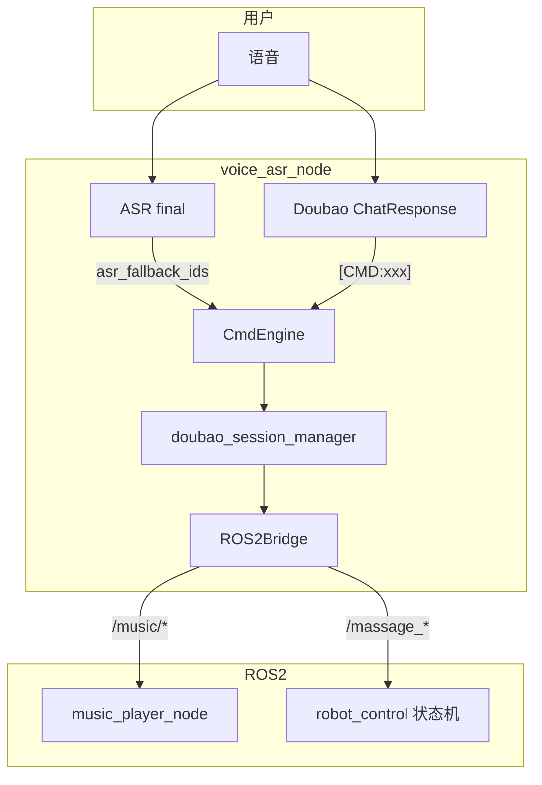

# ROS2 语音命令参考与实施方案

本文档汇总参考工程 [`voice_asr_node-仅供参考`](../../../voice_asr_node-仅供参考) 中 `config/voice_commands.yaml` 的全部已启用能力，并说明在 **wlzc 豆包语音栈**（[`config/command.yaml`](../../../config/command.yaml) + [`config/doubao.yaml`](../../../config/doubao.yaml)）中的落地方式。书写格式以 **音乐命令** 为标杆（LLM `[CMD:xxx]` → `CmdEngine` → `ROS2Bridge` → 服务）。

相关文档：[wake_greeting.md](wake_greeting.md)、[doubao_assistant.md](doubao_assistant.md)、[speaker_id.md](speaker_id.md)。

---

## 1. 架构对比

| 维度 | 参考工程 | 目标工程（wlzc） |
|------|----------|------------------|
| 配置 | `config/voice_commands.yaml` | `config/command.yaml`（运行时注册表） |
| 匹配时机 | STT 终局文本，**先于 LLM** | 默认 `match_mode: llm_tag`，豆包 Chat 句末 `[CMD:xxx]` |
| ASR 本地词 | 全部命令 + rapidfuzz 模糊 | 仅 `settings.asr_fallback_ids` 列出的 id |
| 执行器 | `command_router.py` → `ros2 service call` 子进程 | `doubao_session_manager.py` → `ROS2Bridge`（rclpy） |
| TTS 反馈 | 配置 `reply` 字段 | `tts_confirm` + 模型口语；音乐可 defer |

`config/voice_commands.yaml` 与参考版内容一致，**豆包主链路不加载**；仅作关键词与服务名对照来源。



### 配置文件职责

| 文件 | 路径 | 作用 |
|------|------|------|
| `command.yaml` | `wlzc_massage_robot_ws/config/command.yaml` | 命令 id、匹配模式、ROS 动作、`tts_confirm` |
| `doubao.yaml` | `wlzc_massage_robot_ws/config/doubao.yaml` | `system_role` 中 CMD 语义、歧义澄清、音频策略 |
| `voice_commands.yaml` | 同上目录（归档对照） | 参考关键词，非运行时加载 |

代码入口：[`app_config.py`](../voice_asr_node/config/app_config.py) 固定读取 `command.yaml`；[`cmd_engine.py`](../voice_asr_node/command/cmd_engine.py) 解析 `[CMD:...]`；[`bridge.py`](../voice_asr_node/ros2/bridge.py) 调用服务。

---

## 2. ROS2 服务总表

### 2.1 按摩（robot_control 状态机）

| 服务名 | 类型 | 提供方 | Request | Response |
|--------|------|--------|---------|----------|
| `/massage_pause` | `robot_interfaces/srv/MassagePauseReq` | `robot_control`（`MassagePauseService`） | 空（可选 `trace_header`） | `success`, `message` |
| `/massage_resume` | `MassageResumeReq` | 同上 | 空 | 同上 |
| `/massage_cancel` | `MassageCancelReq` | 同上 | 空 | 同上 |
| `/massage_position_control` | `MassagePositionControlReq` | 同上 | `command`: left/right/forward/backward/clear | `success`, `message`, `rl_offset`, `ud_offset` |
| `/massage_duration_control` | `MassageDurationControlReq` | 同上 | `command`: longer/shorter/set；`duration_value` / `duration_delta` | `success`, `message`, `current_duration`, `remaining_duration` |
| `/massage_force_control` | `MassageForceControlReq` | 同上 | `command`: harder/lighter/set；`force_value` / `force_delta` | `success`, `message`, `current_force` |
| `/massage_process_info_get` | `MassageProcessInfoGetReq` | `GlobalServiceManager` | `attributes[]`（如 `process_info`） | `success`, `massage_process_data`（JSON） |
| `/massage_head_param_control` | `MassageHeadParamControlReq` | 状态机 | `params`（JSON 字符串） | `success`, `message`, `current_params` |

语义：

- **pause**：流程暂停（`SsPause`），可恢复。
- **resume**：从暂停恢复按摩。
- **cancel**：结束本次按摩（与 pause 不同；口语「结束/取消/不按了」应走 cancel）。

### 2.2 音乐（music_player_node）

| 服务名 | 类型 | Request 主要字段 | Response 主要字段 |
|--------|------|------------------|-------------------|
| `/music/control_action` | `MusicControlAction` | `action`（字符串） | `success`, `message`, `current_file` |
| `/music/control_volume` | `MusicControlVolume` | `volume`（0–100 或 0–1，bridge 会归一化） | `success`, `message`, `current_volume` |
| `/music/get_status` | `MusicGetStatus` | 空 | `status`, `volume`, `filename`, `success`, `message` |

话题：`/music_player/states`（`ModuleStates`，1 Hz 心跳）。

### 2.3 `MusicControlAction.action` 取值

| action | 用途 | 语音 CMD |
|--------|------|----------|
| `play` | 播放/随机下一首 | `music_play` |
| `play_named:歌名` | 按文件名匹配曲库 | `music_play_song:歌名` |
| `user_pause` | **用户**暂停背景音乐 | `music_pause` |
| `user_resume` | **用户**恢复背景音乐 | `music_resume` |
| `pause` / `resume` | TTS duck（`tts_music_independent: false` 时内部用） | 无语音 CMD |
| `stop` | 停止播放 | `music_stop` |
| `next` / `previous` | 切歌 | `music_next` / `music_previous` |
| `replay` | 重播当前曲 | `music_replay`（目标独有） |

### 2.4 其它

| 服务/话题 | 状态 | 说明 |
|-----------|------|------|
| `/navigation/move_to` | 已注册未验证 | `command.yaml` → `navigate_to`，需导航栈在线 |
| `/voice_asr/asr_command` | 参考工程专用 | 机械臂 String 指令，目标豆包栈未接 |
| `/voice_asr/states`、`/voice_asr/tts_speak` | 参考工程专用 | Sherpa 栈心跳与 TTS 桥 |

---

## 3. 关键词对照（参考 voice_commands.yaml）

### 3.1 按摩

| intent | 参考 keywords（节选） | 迁入 command.yaml | 与 doubao 语义冲突 |
|--------|----------------------|-------------------|-------------------|
| `massage_pause` | 暂停按摩、按摩暂停、暂时停止、先别按了、停一下按摩、暂停理疗… | 是（不含「停止按摩/理疗」） | 参考含 **停止按摩/停止理疗** → 应对应 **cancel**，已排除 |
| `massage_resume` | 继续按摩、恢复按摩、接着按、重新按摩、继续当前按摩… | 是 | 无 |
| `massage_cancel` | 取消按摩、结束按摩、不按了、终止按摩、按够了、别按了… | 是（不含与 pause 重复的「停掉」短句） | 参考与 pause 共用「停止按摩」→ cancel 保留 |

### 3.2 音乐

| intent | 参考 vs 目标差异 |
|--------|------------------|
| `music_play` | 目标增加英文、`唱一首歌`、ASR defer 播歌逻辑 |
| `music_pause` | 一致使用 `user_pause`；目标增加 regex `^暂停(一下)?音乐$` |
| `music_resume` | 目标仅 LLM 标签（无 ASR keyword） |
| `music_stop` | 目标 regex 更细（「不想听」「结束音乐」） |
| `music_next` / `previous` | 目标 keyword 略少，依赖 LLM 为主 |
| `music_replay` | **仅目标**有，参考无 |

### 3.3 未启用（参考注释）

| intent | 动作 | 话题/载荷 |
|--------|------|-----------|
| `arm_home` | `ros2_topic` | `/voice_asr/asr_command` → `{data: arm_home}` |
| `arm_ready` | 同上 | `arm_ready` |
| `arm_camera` | 同上 | `arm_camera` |
| `arm_package` | 同上 | `arm_package` |

---

## 4. 命令卡片（音乐标准模板）

### 4.1 massage_pause

| 项 | 值 |
|----|-----|
| CMD 标签 | `[CMD:massage_pause]` |
| command.yaml | `id: massage_pause`，`action: ros2_service`，`ros2_service: /massage_pause` |
| doubao.yaml | 【按摩】暂停按摩；【暂停】与音乐区分 |
| ROS2 | `/massage_pause` → `MassagePauseReq`（空请求） |
| action 取值 | 无（非 MusicControl） |
| TTS | 豆包模型口语 + 句末 `[CMD:…]`；**不**发本地 `ChatTTSText` 确认，ASR 路径 **不** `ClientInterrupt` |
| ASR 兜底 | `asr_fallback_ids` 含 `massage_pause`；ROS 在后台线程调用，不阻塞 TTS |
| 参考关键词 | 见 §3.1（已过滤停止→cancel） |

### 4.2 massage_resume

| 项 | 值 |
|----|-----|
| CMD 标签 | `[CMD:massage_resume]` |
| command.yaml | `id: massage_resume`，`ros2_service: /massage_resume` |
| doubao.yaml | 继续按摩、恢复按摩、接着按… |
| ROS2 | `/massage_resume` → `MassageResumeReq` |
| TTS | `好的，继续按摩` |
| ASR 兜底 | 可选 `massage_resume`（低优先级） |
| 执行 | `asyncio.create_task(call_massage_service)`，不阻塞会话 |

### 4.3 massage_cancel

| 项 | 值 |
|----|-----|
| CMD 标签 | `[CMD:massage_cancel]` |
| command.yaml | `id: massage_cancel`，`ros2_service: /massage_cancel` |
| doubao.yaml | 结束/取消/不按了/按够了 → cancel（非 pause） |
| ROS2 | `/massage_cancel` → `MassageCancelReq` |
| TTS | `好的，按摩已取消` |
| ASR 兜底 | 建议 `massage_cancel`（结束需低延迟） |
| 参考关键词 | 见 §3.1 |

### 4.4 music_play

| 项 | 值 |
|----|-----|
| CMD 标签 | `[CMD:music_play]`、`[CMD:music_play_song:歌名]` |
| command.yaml | `music_play` / `music_play_song`（`play_song_defer`） |
| doubao.yaml | 【音乐】整节 + `tts_music_independent` |
| ROS2 | `/music/control_action`，`action: play` 或 `play_named:xxx` |
| TTS | defer：先豆包确认 TTS，再播 MP3；`wait_response` 可填 `{current_file}` |
| ASR 兜底 | `music_play`（可能仅 pending 等 Chat 标签） |

### 4.5 music_pause / music_resume / music_stop

| CMD | music_action | 说明 |
|-----|--------------|------|
| `music_pause` | `user_pause` | 与 TTS 自动 `pause` 隔离 |
| `music_resume` | `user_resume` | 仅「继续听音乐」时用，非首次点歌 |
| `music_stop` | `stop` | ASR 兜底，关音乐低延迟 |

### 4.6 music_next / music_previous / music_replay

| CMD | music_action | wait_response |
|-----|--------------|---------------|
| `music_next` | `next` | 是，`{current_file}` |
| `music_previous` | `previous` | 是 |
| `music_replay` | `replay` | 否（目标扩展） |

### 4.7 volume_up / volume_down / volume_set

| CMD | action | ROS2 |
|-----|--------|------|
| `volume_up` | `music_volume`，`volume_delta: 10` | `adjust_music_volume` → `/music/control_volume` |
| `volume_down` | `volume_delta: -10` | 同上 |
| `volume_set:N` | `volume_mode: absolute` | `set_music_volume` |

### 4.8 dialog_stop_speech

| 项 | 值 |
|----|-----|
| CMD | 无（本地 `stop_tts`） |
| ROS2 | 无 |
| ASR | `dialog_stop_speech` 在 `asr_fallback_ids` |

---

## 5. 歧义与澄清（doubao system_role）

| 用户说法 | 设备行为 |
|----------|----------|
| 仅「暂停」 | 追问：暂停按摩还是背景音乐；**禁止**打 CMD |
| 仅「大一点」 | 追问：力度还是音量；**禁止**打 CMD |
| 暂停按摩 / 暂停音乐 | `[CMD:massage_pause]` / `[CMD:music_pause]` |
| 结束按摩 / 关掉音乐 | `[CMD:massage_cancel]` / `[CMD:music_stop]`（勿混淆） |

实现：`doubao_session_manager` 在命中 `massage_pause` 或 `music_pause` 时清除暂停澄清计时器。

---

## 6. 验证

### 6.1 环境检查

```bash
ros2 service list | grep -E 'massage|music'
```

期望至少可见：`/massage_pause`、`/massage_resume`、`/massage_cancel`、`/music/control_action`、`/music/control_volume`、`/music/get_status`。

### 6.2 CLI 冒烟（无需语音）

```bash
# 按摩（需 robot_control 运行且状态允许）
ros2 service call /massage_pause robot_interfaces/srv/MassagePauseReq "{}"
ros2 service call /massage_resume robot_interfaces/srv/MassageResumeReq "{}"
ros2 service call /massage_cancel robot_interfaces/srv/MassageCancelReq "{}"

# 音乐（需 music_player_node 运行）
ros2 service call /music/control_action robot_interfaces/srv/MusicControlAction "{action: 'play'}"
ros2 service call /music/control_action robot_interfaces/srv/MusicControlAction "{action: 'user_pause'}"
ros2 service call /music/control_action robot_interfaces/srv/MusicControlAction "{action: 'user_resume'}"
ros2 service call /music/control_action robot_interfaces/srv/MusicControlAction "{action: 'stop'}"
ros2 service call /music/control_action robot_interfaces/srv/MusicControlAction "{action: 'next'}"

# 音量
ros2 service call /music/control_volume robot_interfaces/srv/MusicControlVolume "{volume: 50.0}"
ros2 service call /music/get_status robot_interfaces/srv/MusicGetStatus "{}"
```

### 6.3 语音联调清单

- [ ] 「暂停按摩」→ 日志 `[cmd] massage_pause`，状态机进入暂停
- [ ] 「继续按摩」→ `massage_resume`
- [ ] 「结束按摩」/「不按了」→ `massage_cancel`（非 pause）
- [ ] 仅说「暂停」→ 模型追问，无 ROS 调用
- [ ] 「暂停音乐」→ `user_pause`；「继续放音乐」→ `user_resume`
- [ ] 「往左一点」→ `[CMD:massage_position:left]`
- [ ] 「还有多久」→ `[CMD:massage_progress]` + 本地 ChatTTSText 播报真实剩余时间
- [ ] 「延长 5 分钟」→ `[CMD:massage_duration:longer:5]`
- [ ] 「力度大一点」→ `[CMD:massage_force:increase]`（非 volume_up）
- [ ] 「开启负压」→ `[CMD:head_param:neg_pressure:on]`
- [ ] `tts_music_independent: true` 时 TTS 与 MP3 并行，不 SIGSTOP 音乐

---

## 7. 差距与实施清单

| 命令 | ROS 已实现 | LLM 标签 | ASR keyword | asr_fallback | 备注 |
|------|------------|----------|-------------|--------------|------|
| massage_pause | 是 | 是 | 已扩充 | 是 | Chat/ASR 均已接线 |
| massage_resume | 是 | 是 | 已扩充 | 是 | |
| massage_cancel | 是 | 是 | 已扩充 | 是 | |
| massage_position | 是 | 是 | 否 | 否 | `[CMD:massage_position:left]` 等 |
| massage_duration | 是 | 是 | 否 | 否 | longer/shorter/set |
| massage_force | 是 | 是 | 否 | 否 | increase/decrease/set |
| massage_progress | 是 | 是 | 否 | 否 | 查服务后 ChatTTSText |
| head_param | 是 | 是 | 否 | 否 | 负压/微电/射频/冲击波/温度 |
| music_* | 是 | 是 | 已对齐参考词表 | 部分 | `music_resume` 已 ASR 兜底 |
| volume_* | 是 | 是 | 是 | 是 | |
| dialog_stop_speech | 是 | N/A | 是 | 是 | |
| navigate_to | 未接线 | 是 | 否 | 否 | `unsupported_ros2` |
| arm_* | 否 | 否 | 否 | 否 | 参考注释，未接入 |

### 阶段 B（配置 + 代码）— 已完成项

- `command.yaml`：按摩/音乐 keyword 与 `asr_fallback_ids`（含 `music_resume`）
- `doubao.yaml`：【按摩】及位置/时长/力度/进度/按摩头 CMD 语义
- `doubao_session_manager.py`：按摩 ROS2 分发；`massage_query` 查进度后 ChatTTSText
- `bridge.py` + `ros2/massage_cmd.py`：参数化按摩服务与 head_param JSON 构建
- `navigate_to`：`action: unsupported_ros2`（导航未接线）

### 阶段 C — 语音联调

需在完整机器人栈启动后做 §6.3 语音联调。

### 明确不做

- 不将 `command_router.py` / `voice_commands.yaml` 接回豆包主路径
- 不启用参考 `arm_*` topic 路由（除非新增 CMD + 下游节点）

---

## 8. 代码索引

| 模块 | 路径 |
|------|------|
| 命令引擎 | `voice_asr_node/command/cmd_engine.py` |
| 会话与执行 | `voice_asr_node/session/doubao_session_manager.py` |
| ROS 桥 | `voice_asr_node/ros2/bridge.py` |
| 按摩参数解析 | `voice_asr_node/ros2/massage_cmd.py` |
| 音乐节点 | `voice_asr_node/nodes/music_player_node.py` |
| 参考路由器 | `voice_asr_node-仅供参考/voice_asr_node/command_router.py` |
