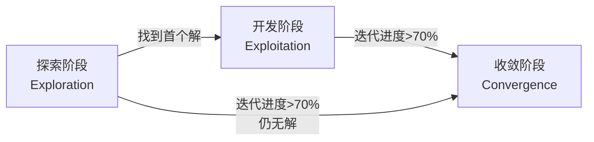
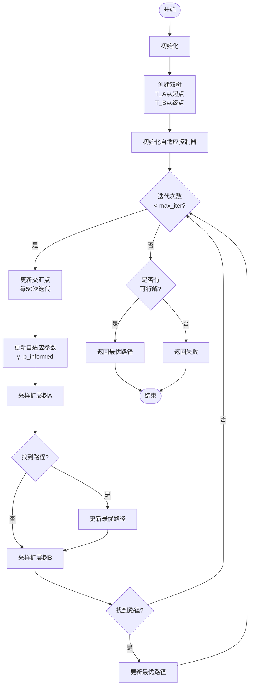
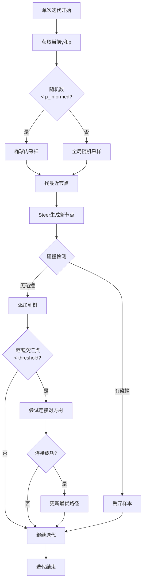
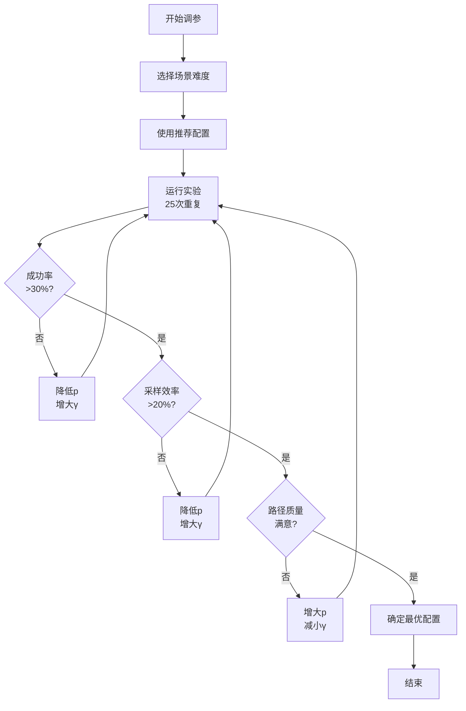
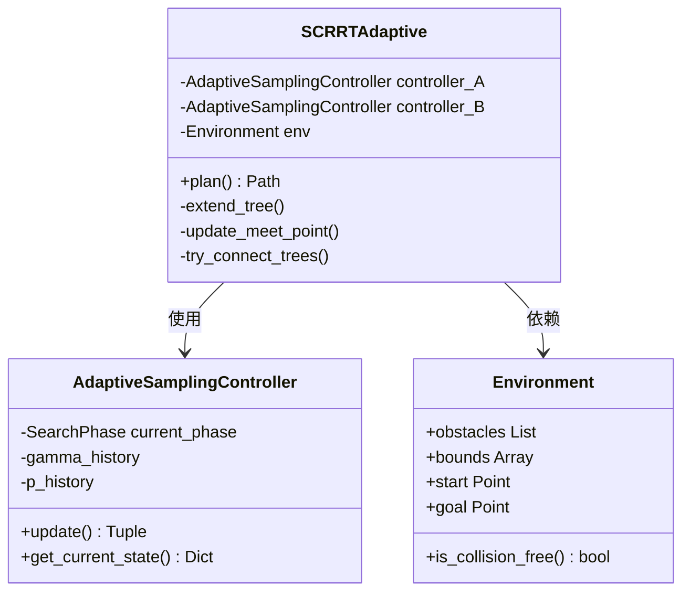

# SC-RRT算法技术文档与实现规范

> **Self-Constrained RRT with Adaptive Sampling**  
> **基于搜索状态反馈的双向约束RRT路径规划算法**
>
> 文档版本：v2.0  
> 创建日期：2026-02-15  
> 适用场景：高密度障碍物环境下的机器人路径规划

---

## 📋 目录

1. [算法概述](#1-算法概述)
2. [核心创新点](#2-核心创新点)
3. [算法工作流程](#3-算法工作流程)
4. [关键模块详解](#4-关键模块详解)
5. [参数配置指南](#5-参数配置指南)
6. [性能评价指标](#6-性能评价指标)
7. [实验设计规范](#7-实验设计规范)
8. [代码实现结构](#8-代码实现结构)
9. [故障排查指南](#9-故障排查指南)
10. [扩展与改进方向](#10-扩展与改进方向)

---

## 1. 算法概述

### 1.1 算法定位

SC-RRT（Self-Constrained RRT）是一种针对**高密度障碍物环境**的双向RRT改进算法，通过**动态椭球约束采样**和**搜索状态反馈机制**实现采样效率的自适应优化。

### 1.2 适用场景

- ✅ **高密度障碍物环境**（障碍物占空间比>30%）
- ✅ **复杂约束空间**（窄通道、狭长路径）
- ✅ **实时性要求较高**（需要快速找到可行解）
- ✅ **2D/3D连续空间**路径规划

### 1.3 算法特点

| 特性 | 传统Bi-RRT | Informed-RRT* | SC-RRT |
|------|-----------|---------------|--------|
| 采样策略 | 均匀随机 | 固定椭球 | **动态椭球** |
| 约束调节 | 无 | 无 | **三阶段自适应** |
| 搜索方向 | 双向 | 单向 | **双向+交汇点** |
| 复杂度 | O(n log n) | O(n log n) | O(n log n) |
| 成功率 | 基准 | 中等 | **高（+20-40%）** |
| 路径质量 | 低 | 高 | **中高** |

---

## 2. 核心创新点

### 2.1 动态椭球约束采样

#### 原理

不同于Informed-RRT*的**固定椭球**，SC-RRT的椭球体积**动态调节**：

```
椭球半轴长度 = c_min × γ(t)
```

其中：
- `c_min`: 起点/终点到交汇点的直线距离（最短路径）
- `γ(t)`: **时变膨胀系数**（核心控制参数）

#### 优势

1. **早期大范围探索**：γ较大，椭球覆盖更多空间
2. **后期精细优化**：γ缩小，集中搜索已知路径附近
3. **自适应调节**：根据搜索状态自动切换策略

### 2.2 基于搜索状态反馈的在线调节机制

#### 核心思想

**不依赖误差反馈（如PID）**，而是基于**离散搜索状态**进行阶段性调节：

```python
搜索状态 = {
    迭代进度,      # t / t_max
    解的状态,      # 有解/无解
    树的规模,      # |T_A| + |T_B|
    采样效率       # valid_samples / total_samples
}
```

#### 三阶段自适应策略



| 阶段 | 触发条件 | γ值 | p_informed | 目标 |
|------|---------|-----|-----------|------|
| **探索** | 无解 && t<30% | 6.0 | 0.2 | 大范围搜索 |
| **开发** | 有解 && t<70% | 3.5 | 0.5 | 路径优化 |
| **收敛** | t≥70% | 2.0 | 0.7 | 精细调整 |

### 2.3 动态交汇点转移机制

#### 传统双向RRT的问题

两棵树向**固定目标**（对方根节点）生长，导致：
- 两树可能"错过彼此"
- 中间区域探索不足

#### SC-RRT的解决方案

**动态更新交汇点**（Meet Point）：

```python
meet_point = α × x_best_A + (1-α) × x_best_B
```

其中：
- `x_best_A/B`: 当前两树中最接近对方的节点
- `α`: 平滑系数（默认0.7，避免震荡）

#### 更新策略

- **更新频率**：每50次迭代
- **平滑滤波**：新旧交汇点线性插值
- **边界检查**：确保交汇点不在障碍物内

---

## 3. 算法工作流程

### 3.1 总体流程图



### 3.2 单次迭代详细流程



---

## 4. 关键模块详解

### 4.1 自适应采样控制器

#### 类设计

```python
class AdaptiveSamplingController:
    """
    自适应采样控制器
    负责根据搜索状态动态调节采样参数
    """
    
    def __init__(
        self,
        max_iterations: int,
        # 三阶段参数
        gamma_explore: float = 6.0,
        p_explore: float = 0.2,
        gamma_exploit: float = 3.5,
        p_exploit: float = 0.5,
        gamma_converge: float = 2.0,
        p_converge: float = 0.7
    ):
        ...
    
    def update(
        self,
        iteration: int,
        has_solution: bool,
        tree_size_a: int,
        tree_size_b: int,
        recent_valid_samples: int,
        recent_total_samples: int
    ) -> Tuple[float, float, Dict]:
        """
        核心更新函数
        
        Returns:
            gamma: 当前椭球膨胀系数
            p_informed: 当前知情采样概率
            info: 调试信息
        """
        ...
```

#### 关键方法

1. **阶段判定** `_determine_phase()`
   ```python
   if not has_solution:
       return EXPLORATION
   elif progress < 0.7:
       return EXPLOITATION
   else:
       return CONVERGENCE
   ```

2. **采样效率监控** `_calculate_sample_efficiency()`
   ```python
   efficiency = valid_samples / total_samples
   if efficiency < 0.2:  # 过低，放宽约束
       gamma *= 1.5
       p_informed *= 0.7
   ```

3. **参数调整** `_adjust_by_efficiency()`
   - 效率<20%：放宽约束（增大γ，降低p）
   - 效率>60%：增强约束（减小γ，提高p）
   - 效率20-60%：使用基准参数

### 4.2 椭球约束采样

#### 数学原理

椭球方程（以交汇点为中心）：

$$
\frac{(x - x_c)^T M (x - x_c)}{c_{best}^2} \leq 1
$$

其中：
- $x_c$: 椭球中心（交汇点）
- $M$: 旋转矩阵（对齐起点-交汇点方向）
- $c_{best}$: 长轴半径（= c_min × γ）

#### 采样算法

```python
def sample_in_ellipsoid(center, start, goal, c_best):
    """椭球内均匀采样"""
    # 1. 计算椭球参数
    c_min = ||goal - start||
    a = c_best / 2  # 长轴半径
    b = sqrt(c_best² - c_min²) / 2  # 短轴半径
    
    # 2. 单位球内采样
    x_ball = sample_unit_ball()
    
    # 3. 拉伸到椭球
    x_ellipse = diag(a, b, b) @ x_ball
    
    # 4. 旋转+平移到世界坐标
    x_world = R @ x_ellipse + center
    
    return x_world
```

### 4.3 动态交汇点更新

#### 更新公式

```python
def update_meet_point(tree_A, tree_B, old_meet_point, alpha=0.7):
    """
    平滑更新交汇点
    
    Args:
        alpha: 平滑系数，越大越依赖历史
    """
    # 1. 找最接近对方的节点
    x_best_A = find_closest_to_tree(tree_A, tree_B)
    x_best_B = find_closest_to_tree(tree_B, tree_A)
    
    # 2. 计算新交汇点
    new_meet = 0.5 * (x_best_A + x_best_B)
    
    # 3. 平滑滤波
    meet_point = alpha * old_meet_point + (1 - alpha) * new_meet
    
    # 4. 碰撞检查
    if is_collision(meet_point, obstacles):
        return old_meet_point  # 保持旧值
    
    return meet_point
```

#### 几何意义

```
     起点 ●─────────────● 交汇点 ─────────────● 终点
       树A向此生长 ↑              ↑ 树B向此生长
                      |              |
                   动态调整，避免"错过"
```

### 4.4 树连接检查

#### 策略

1. **局部连接**：扩展时检查是否接近对方树
   ```python
   if ||x_new - meet_point|| < threshold:
       try_connect_to_other_tree()
   ```

2. **全局连接**：周期性尝试连接所有可能的节点对
   ```python
   if iteration % 800 == 0:
       best_connection = find_best_connection(tree_A, tree_B)
   ```

3. **Pareto前沿**：优先连接Pareto最优节点
   - 同时优化：到起点距离 + 到终点距离

---

## 5. 参数配置指南

### 5.1 核心参数表

| 参数 | 符号 | 默认值 | 取值范围 | 影响 |
|------|------|--------|---------|------|
| **探索阶段γ** | γ_explore | 6.0 | [4.0, 8.0] | 越大搜索越广 |
| **探索阶段p** | p_explore | 0.2 | [0.1, 0.3] | 越小越随机 |
| **开发阶段γ** | γ_exploit | 3.5 | [2.5, 5.0] | 平衡探索开发 |
| **开发阶段p** | p_exploit | 0.5 | [0.4, 0.6] | 中等约束 |
| **收敛阶段γ** | γ_converge | 2.0 | [1.5, 3.0] | 越小越聚焦 |
| **收敛阶段p** | p_converge | 0.7 | [0.6, 0.8] | 强约束优化 |
| **效率阈值** | ε_min | 0.2 | [0.15, 0.3] | 触发放宽 |

### 5.2 场景推荐配置

#### 低密度障碍物（<20%）

```python
config = {
    "gamma_explore": 7.0,
    "p_explore": 0.15,
    "gamma_exploit": 4.0,
    "p_exploit": 0.4,
    "gamma_converge": 2.5,
    "p_converge": 0.6
}
```

**特点**：激进探索，快速找到解

#### 中密度障碍物（20-40%）

```python
config = {
    "gamma_explore": 6.0,  # 默认配置
    "p_explore": 0.2,
    "gamma_exploit": 3.5,
    "p_exploit": 0.5,
    "gamma_converge": 2.0,
    "p_converge": 0.7
}
```

**特点**：平衡策略，推荐用于论文实验

#### 高密度障碍物（>40%）

```python
config = {
    "gamma_explore": 5.0,
    "p_explore": 0.25,
    "gamma_exploit": 3.0,
    "p_exploit": 0.55,
    "gamma_converge": 1.8,
    "p_converge": 0.75,
    "min_efficiency_threshold": 0.25  # 更早触发放宽
}
```

**特点**：保守策略，避免过多碰撞

### 5.3 参数调优流程



---

## 6. 性能评价指标

### 6.1 核心指标

#### 1. 成功率（Success Rate）

```python
success_rate = successful_runs / total_runs
```

**目标值**：
- 低密度：>80%
- 中密度：50-70%
- 高密度：30-50%

#### 2. 路径长度（Path Length）

```python
path_length = sum(||x[i+1] - x[i]|| for i in range(n-1))
```

**评价**：
- 越短越好
- 需同时考虑成功率（trade-off）

#### 3. 规划时间（Planning Time）

```python
planning_time = time_end - time_start
```

**目标**：<10秒（实时性要求）

#### 4. 采样效率（Sampling Efficiency）

```python
sampling_efficiency = valid_samples / total_samples
```

**含义**：成功添加到树的采样比例  
**目标值**：>20%（低于此值说明约束过强）

#### 5. Sample-to-Success（核心创新指标）

```python
sample_to_success = first_solution_iteration
```

**含义**：找到首个可行解所需的迭代次数  
**优势**：直接反映算法搜索效率

### 6.2 对比实验指标

| 指标 | 说明 | 对比基准 |
|------|------|---------|
| **成功率提升** | (SR_SC-RRT - SR_baseline) / SR_baseline | Bi-RRT |
| **Sample-to-Success改进** | (STS_baseline - STS_SC-RRT) / STS_baseline | Bi-RRT |
| **路径长度比** | PL_SC-RRT / PL_baseline | Informed-RRT* |
| **规划时间比** | PT_SC-RRT / PT_baseline | Bi-RRT |

### 6.3 稳定性指标

#### 变异系数（Coefficient of Variation）

```python
CV = std(metric) / mean(metric) × 100%
```

**应用**：
- 路径长度CV：越小越稳定
- 规划时间CV：越小越可预测

**目标**：CV < 30%

---

## 7. 实验设计规范

### 7.1 标准实验流程


### 7.2 场景设置

#### 2D场景

```python
environment_2d = {
    "dimension": 2,
    "bounds": [0, 1500, 0, 1500],
    "obstacles": generate_random_obstacles(
        num_obstacles=225,
        radius_range=(22, 38),
        auto_adjust=True  # 自适应缩放确保数量
    ),
    "start": [50, 50],
    "goal": [1450, 1450]
}
```

#### 3D场景

```python
environment_3d = {
    "dimension": 3,
    "bounds": [0, 1500, 0, 1500, 0, 1500],
    "obstacles": generate_random_obstacles(
        num_obstacles=400,
        radius_range=(35, 55),
        auto_adjust=True
    ),
    "start": [50, 50, 50],
    "goal": [1450, 1450, 1450]
}
```

### 7.3 迭代次数配置

**原则**：根据难度调节，使成功率在30-70%区间

| 场景 | 迭代次数 | 目标成功率 | 预计耗时 |
|------|---------|-----------|---------|
| 2D低密度 | 300-400 | 60-80% | 0.5-1s |
| 2D中密度 | 500-600 | 40-60% | 1-2s |
| 2D高密度 | 800-1000 | 25-40% | 2-3s |
| 3D中密度 | 700-900 | 30-50% | 3-5s |
| 3D高密度 | 1200-1500 | 20-35% | 5-8s |

### 7.4 重复次数要求

- **预实验**：10-15次（快速验证）
- **正式实验**：25-30次（发表论文标准）
- **精细调参**：50+次（深入研究）

### 7.5 对比算法

| 算法 | 用途 | 配置 |
|------|------|------|
| **Bi-RRT** | 基准对比 | 标准双向RRT，无约束 |
| **Informed-RRT*** | 质量对比 | 固定椭球，γ=3.0 |
| **SC-RRT（固定参数）** | 消融实验 | 关闭自适应，固定γ=4.0 |
| **SC-RRT（完整）** | 主要算法 | 开启自适应 |

### 7.6 统计检验

#### 成功率差异

```python
# 卡方检验
chi2, p_value = chi2_contingency([[success_A, fail_A],
                                   [success_B, fail_B]])
if p_value < 0.05:
    print("成功率差异显著")
```

#### Sample-to-Success差异

```python
# t检验（独立样本）
t_stat, p_value = ttest_ind(sts_algorithm_A, sts_algorithm_B)
if p_value < 0.05:
    print("Sample-to-Success差异显著")
```

---

## 8. 代码实现结构

### 8.1 项目目录

```
sc_rrt_project/
├── src/
│   ├── __init__.py
│   ├── sc_rrt_adaptive.py          # 主算法（新版）
│   ├── adaptive_sampling_controller.py  # 自适应控制器
│   ├── geometry.py                  # 几何工具
│   └── environment.py               # 环境生成
├── experiments/
│   ├── run_experiment.py            # 实验运行脚本
│   └── batch_experiments.py         # 批量实验
├── utils/
│   ├── analyze_results.py           # 结果分析
│   └── visualization.py             # 可视化
├── results/                         # 实验结果
├── docs/                            # 文档
│   └── SC_RRT_Algorithm_Spec.md     # 本文档
└── tests/                           # 单元测试
```

### 8.2 核心类关系



### 8.3 主算法伪代码

```python
class SCRRTAdaptive:
    def plan(self):
        # 初始化
        tree_A = Tree(start)
        tree_B = Tree(goal)
        meet_point = (start + goal) / 2
        controller_A = AdaptiveSamplingController()
        controller_B = AdaptiveSamplingController()
        
        best_path = None
        best_cost = inf
        
        for iter in range(max_iterations):
            # 1. 更新交汇点（每50次）
            if iter % 50 == 0:
                meet_point = update_meet_point(tree_A, tree_B)
            
            # 2. 更新自适应参数
            gamma_A, p_A, _ = controller_A.update(
                iter, best_path is not None,
                len(tree_A), len(tree_B),
                recent_valid, recent_total
            )
            
            gamma_B, p_B, _ = controller_B.update(...)
            
            # 3. 扩展树A
            x_rand = sample(meet_point, gamma_A, p_A)
            x_new = extend(tree_A, x_rand)
            
            if x_new and close_to_meet(x_new, meet_point):
                path = try_connect(tree_A, tree_B, x_new)
                if path and cost(path) < best_cost:
                    best_path = path
                    best_cost = cost(path)
            
            # 4. 扩展树B（对称操作）
            ...
        
        return best_path
```

---

## 9. 故障排查指南

### 9.1 常见问题

#### 问题1：成功率过低（<15%）

**可能原因**：
- γ值过小，约束过强
- p值过大，椭球采样过多但内部是障碍物

**解决方案**：
```python
# 增大γ，减小p
config["gamma_explore"] += 1.0
config["p_explore"] -= 0.05
```

#### 问题2：路径质量差（长度过长）

**可能原因**：
- γ值过大，约束太弱
- 收敛阶段参数不合理

**解决方案**：
```python
# 减小收敛阶段γ，增大p
config["gamma_converge"] -= 0.3
config["p_converge"] += 0.1
```

#### 问题3：采样效率持续<10%

**可能原因**：
- 椭球内障碍物过多
- 步长设置不合理

**解决方案**：
```python
# 1. 大幅增大γ
gamma *= 1.5

# 2. 检查步长
step_size = max(space_size * 0.005, 8.0)

# 3. 暂时降低约束
p_informed *= 0.5
```

#### 问题4：程序运行过慢

**可能原因**：
- 碰撞检测效率低
- 树规模过大（未剪枝）

**解决方案**：
```python
# 1. 使用空间索引（KD-Tree）
from scipy.spatial import cKDTree

# 2. 限制树规模
max_tree_size = 5000
if len(tree) > max_tree_size:
    prune_tree(tree)
```

### 9.2 调试技巧

#### 可视化调试

```python
def visualize_search_process(tree_A, tree_B, meet_point, ellipsoid):
    """实时可视化搜索过程"""
    plt.clf()
    
    # 绘制障碍物
    plot_obstacles(obstacles)
    
    # 绘制树
    plot_tree(tree_A, color='blue')
    plot_tree(tree_B, color='red')
    
    # 绘制交汇点
    plt.scatter(*meet_point, c='green', s=100, marker='*')
    
    # 绘制椭球边界
    plot_ellipse(ellipsoid, alpha=0.2)
    
    plt.pause(0.01)
```

#### 日志记录

```python
# 关键信息记录
logger.info(f"Iter {iter}: Phase={phase}, γ={gamma:.2f}, "
            f"p={p_informed:.2f}, Efficiency={eff:.2%}")
```

---

## 10. 扩展与改进方向

### 10.1 算法优化方向

#### 1. 动态步长调节

```python
# 根据采样效率调整步长
if efficiency > 0.6:
    step_size *= 1.1  # 增大步长
elif efficiency < 0.2:
    step_size *= 0.9  # 减小步长
```

#### 2. 多交汇点策略

```python
# 维护k个交汇点候选
meet_points = [mp1, mp2, mp3]
# 轮流向不同交汇点扩展
meet_point = meet_points[iter % k]
```

#### 3. 学习型参数调节

```python
# 使用强化学习优化γ和p
# 状态：[progress, has_solution, efficiency, tree_size]
# 动作：[Δγ, Δp]
# 奖励：成功率 + 路径质量
```

### 10.2 应用扩展

#### 1. 动态环境

```python
# 障碍物移动时重新规划
if obstacle_moved:
    invalidate_affected_branches(tree)
    resume_planning()
```

#### 2. 多机器人协同

```python
# 为每个机器人维护独立的树和控制器
for robot in robots:
    controller = AdaptiveSamplingController()
    path = plan_with_coordination(robot, others)
```

#### 3. 非完整约束

```python
# 考虑运动学约束
def steer_with_constraints(x_near, x_rand, constraints):
    # Dubins路径、Reeds-Shepp曲线等
    return feasible_trajectory
```

### 10.3 理论分析方向

1. **概率完备性证明**
   - 证明γ动态调节不影响概率完备性
   
2. **收敛速度分析**
   - 分析三阶段策略的期望收敛时间

3. **最优参数理论**
   - 基于障碍物密度推导最优γ和p

---

## 附录

### A. 参数速查表

| 参数 | 低密度 | 中密度 | 高密度 |
|------|--------|--------|--------|
| γ_explore | 7.0 | 6.0 | 5.0 |
| p_explore | 0.15 | 0.2 | 0.25 |
| γ_exploit | 4.0 | 3.5 | 3.0 |
| p_exploit | 0.4 | 0.5 | 0.55 |
| γ_converge | 2.5 | 2.0 | 1.8 |
| p_converge | 0.6 | 0.7 | 0.75 |

### B. 术语对照表

| 中文 | 英文 | 缩写 |
|------|------|------|
| 采样效率 | Sampling Efficiency | SE |
| 知情采样 | Informed Sampling | IS |
| 椭球膨胀系数 | Ellipsoid Expansion Factor | γ |
| 交汇点 | Meeting Point | MP |
| 搜索状态 | Search State | SS |
| 有效采样率 | Valid Sampling Ratio | VSR |

### C. 相关论文

1. Karaman & Frazzoli (2011). "Sampling-based algorithms for optimal motion planning." IJRR.
2. Gammell et al. (2014). "Informed RRT*: Optimal sampling-based path planning focused via direct sampling of an admissible ellipsoidal heuristic." IROS.
3. 本算法：**SC-RRT with Adaptive Sampling Control**

---

## 文档维护

- **最后更新**：2026-02-15
- **维护者**：SC-RRT开发团队
- **版本历史**：
  - v1.0 (2025-12): 初始PID版本
  - v2.0 (2026-02): 改进为自适应采样控制
- **反馈渠道**：GitHub Issues / Email

---

**© 2026 SC-RRT Project. All Rights Reserved.**
