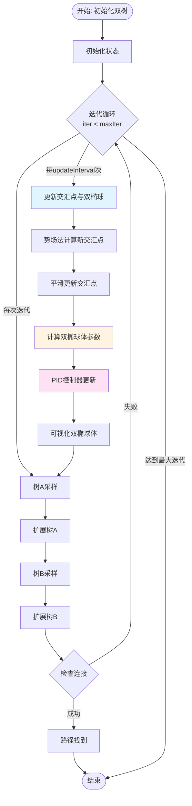
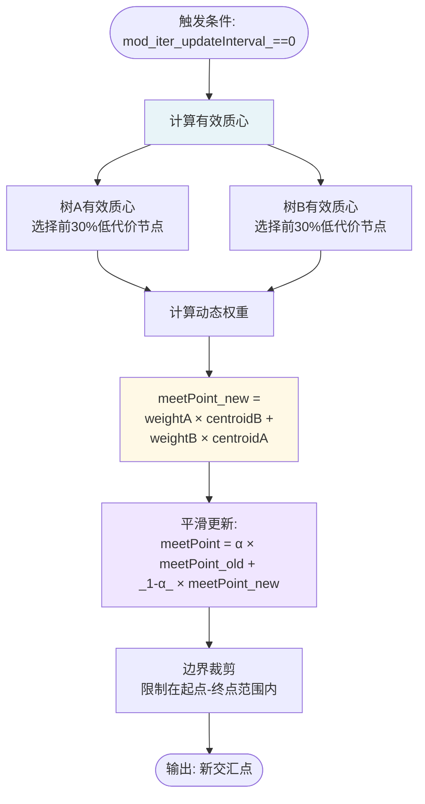
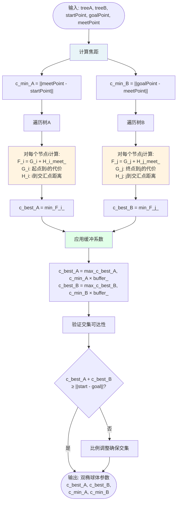
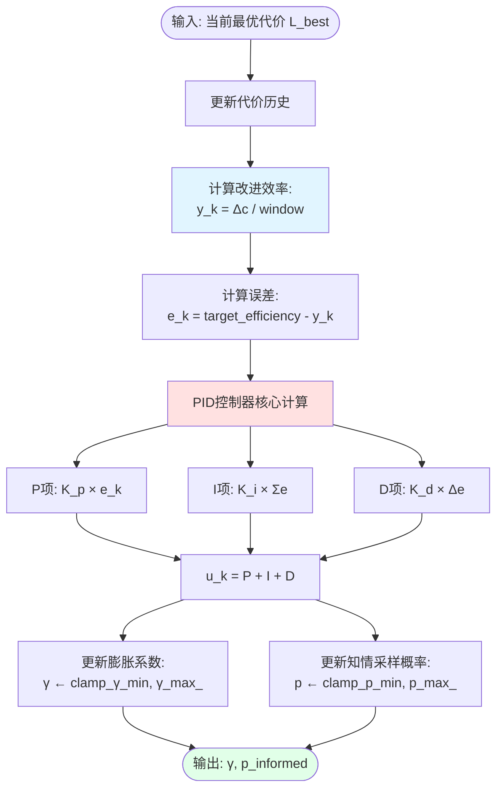
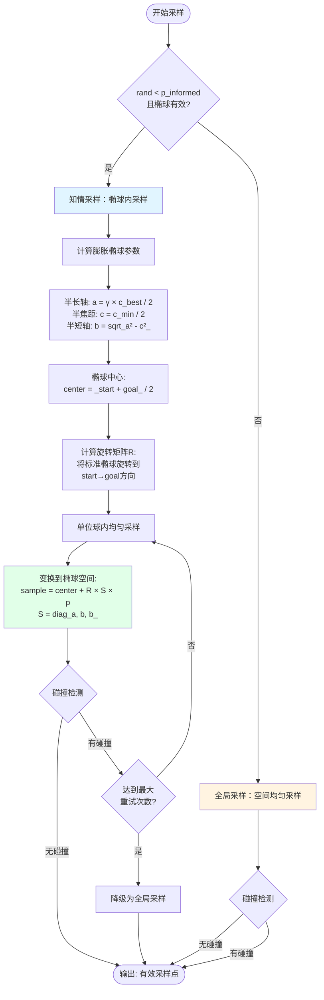
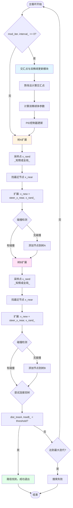

# SC-RRT算法：自适应双向超椭球体工作流程图

## 概述

本文档描述SC-RRT（Sampling-Constrained RRT）算法中自适应双向超椭球体采样约束机制的完整工作流程。核心思想是通过动态交汇点和双椭球体约束实现高效的双向搜索空间收敛。

---

## 整体流程图

---

## 核心模块详细流程

### 1. 交汇点更新流程

**关键参数：**
- `α`（smoothingFactor）：平滑系数，默认0.7，防止交汇点振荡
- 权重计算：`weightA = sizeA / (sizeA + sizeB)`

---

### 2. 双椭球体参数计算流程

**椭球体定义：**
- **椭球体A**：焦点为`(startPoint, meetPoint)`，半长轴`a = c_best_A / 2`
- **椭球体B**：焦点为`(meetPoint, goalPoint)`，半长轴`a = c_best_B / 2`
- **缓冲系数**：默认1.2，防止过小椭球导致采样困难

---

### 3. PID控制器更新流程（简化）

**PID控制逻辑：**
- **改进缓慢**（`e_k > 0`）→ 增大`γ`，减小`p` → **增强探索**
- **改进顺利**（`e_k < 0`）→ 减小`γ`，增大`p` → **加强开发**

---

### 4. 知情采样流程

**关键点：**
- `γ`（gamma）：椭球膨胀系数，由PID控制，范围`[1.0, 4.0]`
- `p_informed`：知情采样概率，由PID控制，范围`[0.2, 0.95]`

---

### 5. 完整双向扩展流程

---

## 关键参数汇总

| 参数 | 默认值 | 说明 |
|------|--------|------|
| `updateInterval` | 50 | 交汇点更新间隔（迭代次数） |
| `smoothingFactor` | 0.7 | 交汇点平滑系数α |
| `ellipsoidBuffer` | 1.2 | 椭球体缓冲系数 |
| `gamma` | 1.0~4.0 | 椭球膨胀系数（PID控制） |
| `p_informed` | 0.2~0.95 | 知情采样概率（PID控制） |
| `targetEfficiency` | 0.02 | PID目标改进效率 |
| `Kp, Ki, Kd` | 2.0, 0.2, 0.8 | PID控制器增益 |

---

## 自适应机制说明

### 1. 动态交汇点转移
- **目的**：引导双树向潜在最优连接点收敛
- **方法**：势场法计算有效质心，动态权重加权
- **优势**：避免盲目双向扩展，提高搜索效率

### 2. 非对称双椭球约束
- **椭球体A**：约束树A向交汇点扩展
- **椭球体B**：约束树B向交汇点扩展
- **非对称性**：两椭球体参数独立计算，适应不同搜索进度

### 3. PID自适应采样控制
- **被控量**：路径改进效率
- **控制量**：椭球膨胀系数γ、知情采样概率p
- **效果**：根据搜索效果自动平衡"探索"与"开发"

---

## 算法优势

1. **高效收敛**：双椭球体约束聚焦有效搜索空间
2. **自适应性**：PID控制动态调节采样策略
3. **双向协同**：交汇点机制引导双树高效对接
4. **鲁棒性强**：平滑更新和缓冲机制防止震荡

---

## 应用场景

- 高维空间路径规划
- 复杂障碍物环境
- 实时动态规划
- 多约束优化问题

---

**文档创建时间**：2026年1月29日  
**算法版本**：SC-RRT v1.3  
**参考代码**：`SC_RRT_Bidirectional.m`
