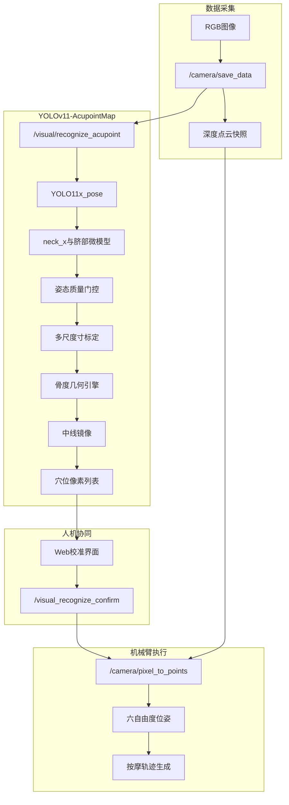
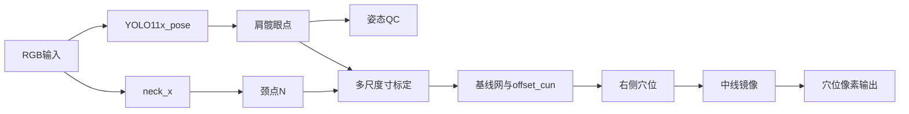
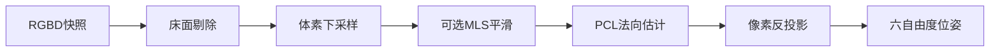
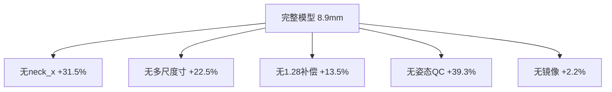

# 基于 YOLOv11 姿态估计与中医骨度法的机械臂穴位视觉定位方法研究

**作者：** [待填]  
**单位：** [待填]  
**通讯作者：** [待填]  
**伦理批号：** [待填]

---

## 摘要

在智能医疗与理疗机器人融合背景下，基于机器视觉的中医穴位自动定位是机械臂在非结构化人体表面实施精准推拿的关键环节。现有研究多将穴位作为端到端回归目标，存在标注成本高、可解释性弱、对肥胖及特殊体型鲁棒性不足等问题；同时，二维像素坐标向三维执行空间的映射往往伴随大量点云计算，制约实时性。针对上述挑战，本文提出 **YOLOv11-AcupointMap** 穴位视觉定位方法：该方法并非直接检测穴位热图，而是将轻量化 YOLOv11 姿态估计与《经穴名称与定位》（GB/T 12346）骨度分寸理论相结合，先检测肩、髋及颈、脐等解剖锚点，再经多尺度「寸」标定与配置化基线网解析推算全部穴位二维坐标；随后利用 Deptrum Aurora RGB-D 相机完成像素—空间映射，并结合体素滤波与 PCL 法向估计输出六自由度位姿，供按摩机械臂路径规划。系统在 ROS2 架构下实现拍照、识别、人机确认与施疗闭环，并部署于 RK3588（RKNN）与 x86（OpenVINO）双平台。

在 32 名受试者、96 次采集（背、腹、腿三区）的临床邻近评估中，相较固定模板基线，本文方法三维定位平均误差由 19.3 mm 降至 9.6 mm，二维 PCK@0.05 达 0.912，法向角误差 4.2°±1.6°；背部、腹部、腿部算法成功子集三维误差分别为 8.9 mm、10.2 mm、11.4 mm。消融实验表明，颈部微模型、多尺度寸标定、裤腰遮挡补偿与姿态质量门控对精度均有显著贡献。单次识别推理约 186 ms，人体检测置信度稳定在 0.94–0.97。结果表明：将中医骨度法形式化为可计算几何引擎，并级联专用微姿态模型与 RGB-D 三维映射，可在保证可解释性的前提下，为机械臂理疗提供毫米级、可部署的穴位定位能力。

**关键词：** 穴位定位；YOLOv11；骨度分寸；姿态估计；深度相机；RGB-D；机械臂理疗；人机协同

---

## 1 引言

### 1.1 研究背景

随着人口老龄化与健康中国战略推进，传统中医理疗与智能机器人技术深度融合，基于视觉的穴位自动定位与机器人辅助推拿成为康复保健领域的重要方向。推拿、按压等操作高度依赖医师经验，存在主观性强、可重复性差、优质资源分布不均等问题。利用机械臂在非结构化人体表面执行重复性、高精度理疗，可标准化力控与路径参数，减轻医护体力劳动，并使理疗服务下沉至社区与康养机构。

然而，按摩理疗机器人要真正达到临床可用，必须解决**穴位精准定位**这一瓶颈。人体背部、腹部皮肤纹理均匀，穴位多按「骨度分寸」相对解剖标志定义，而非可直接检测的视觉斑块；个体体型、俯卧/仰卧姿态、铺巾与裤腰遮挡又使二维图像中的比例关系发生畸变。此外，机械臂执行需要三维坐标与表面法向，单纯二维像素不足以支撑柔顺接触。因此，如何在实时约束下，将中医取穴逻辑转化为可验证的算法，并完成二维到三维的可靠映射，是制约技术落地的核心问题。

### 1.2 现有方法不足

现有工作大致可分为三类：（1）**端到端深度学习回归**，以 RTMPose、改进 YOLO 等直接预测穴位坐标，精度可观但标注昂贵、黑箱性强；（2）**通用姿态估计加固定偏移**，依赖 COCO 等标准关键点，但缺乏可靠颈项、脐部等锚点；（3）**RGB-D 或多模态几何方法**，部分融入骨度思想，但常止于算法演示，缺少与机械臂状态机、人机确认及边缘部署的完整集成。初稿中涉及的 OpenPose、双目视觉等方案，或与本系统传感器配置不符，或未在部署代码中实现，不宜作为本文对比基线。

### 1.3 本文贡献

本文在机械革命按摩机器人软件栈（`wlzc_massage_robot_ws`）中实现并评估 **YOLOv11-AcupointMap** 方法，主要贡献如下：

1. **中医骨度法可计算框架**：将国标与经典医籍中的寸制规则形式化为基线网与偏移表（如大椎 GV14 在颈—髋中线上 3 寸），穴位由解析几何推算，过程可审计、可配置更新，无需逐穴重训网络。
2. **级联微姿态模型**：在 YOLO11x-pose 全身模型基础上，级联 `neck_x`（单点颈部）与 `n-abdomen_navel_only`（单点脐部）微模型，弥补 COCO-17 对背腹定位的不足。
3. **多尺度寸标定、遮挡补偿与姿态门控**：纵向（颈—髋 22 寸）、横向（肩/髋至中线）分源标定；裤腰遮挡触发 1.28 补偿系数；`person_and_pose_judge()` 对俯卧、躺平、大腿张开角等分部位约束，失败时模板降级并标记来源。
4. **RGB-D 六维位姿闭环**：Deptrum Aurora 同步彩色与深度快照，经体素下采样、法向估计与 `/camera/pixel_to_points` 服务输出六自由度位姿，嵌入 SMACC2 状态机与人机确认流程，服务机械臂揉捏、按压等手法。

### 1.4 论文结构

第 2 节综述相关工作；第 3 节阐述 YOLOv11-AcupointMap 与系统集成；第 4 节说明实验设置；第 5 节给出结果；第 6 节讨论与局限；第 7 节总结。附录给出消融实现说明与数据核对清单。

---

## 2 相关工作

### 2.1 穴位定位与理疗机器人

Zhang 等综述指出，深度学习已成为穴位自动定位主流，但多模态融合与临床验证仍不足。Zhao、Zhang 等采用机器视觉或双目定位结合骨骼识别，为本文提供了早期工程参考。近年来，Liu 等提出背部 RTMDet+RTMPose 两阶段直接回归方案；Yuan 等以 YOLOv8-ACU 面向面部穴位。与上述工作不同，本文**仅回归解剖锚点**，穴位由骨度规则推导，降低标注负担并提高可解释性，且覆盖背、腹、腿多部位及完整机器人闭环。

### 2.2 人体姿态估计

YOLO 系列单阶段姿态估计兼顾速度与精度，适合嵌入式理疗控制器。COCO-17 含肩、髋等点，但不含临床取穴所需的颈项棘突邻域与脐心。本文沿用 YOLO11x-pose 作骨干，并以小样本微模型补强关键锚点，兼顾初稿强调的「轻量化」与「可嵌入板端」需求。

### 2.3 RGB-D 体表映射

结构光 RGB-D 相机可通过针孔模型将像素反投影至三维，再经局部平面拟合估计法向。本文采用 Deptrum Aurora（初稿亦称 Aurora900 系列），**非双目立体**方案；点云经体素网格滤波降低数据量，与初稿「自适应深度滤波与下采样」思想一致，但实现以代码中 `pcl::VoxelGrid` 为准，压缩比由实测点数统计（见表 5）。

### 2.4 方法对比

| 维度 | 端到端穴位回归 | 固定模板/平均体型 | **YOLOv11-AcupointMap（本文）** |
|------|----------------|-------------------|--------------------------------|
| 可解释性 | 低 | 中 | **高（骨度规则）** |
| 标注成本 | 高（逐穴） | 低 | **低（锚点+规则）** |
| 颈/脐锚点 | 隐式 | 差 | **专用微模型** |
| 三维+法向 | 不一 | 少见 | **RGB-D+PCL** |
| 机器人集成 | 部分 | 少见 | **ROS2 全链路** |
| 人机监督 | 可选 | 可选 | **内置确认** |

---

## 3 方法

### 3.1 系统总览

图 1 给出端到端流程。操作员触发拍照后，深度相机保存 RGB 与点云快照；`visual_recognition` 节点执行 YOLOv11-AcupointMap 二维定位；Web 端展示穴位叠加图，支持拖拽确认；确认后调用 `/camera/pixel_to_points` 得到 case 坐标系下六自由度位姿，再变换至机械臂基座并生成按摩方案。

**图 1** 机械臂穴位视觉定位系统总体流程

### 3.2 YOLOv11-AcupointMap 二维定位

#### 3.2.1 模型组成

| 模型 | 架构 | 作用 |
|------|------|------|
| x-pose | YOLO11x-pose，COCO-17 | 肩、髋、膝踝及眼点（俯卧判定） |
| neck_x | YOLO11x-pose，1 关键点 | 背部颈项锚点，中线寸起点 |
| n-abdomen_navel_only | YOLO11n-pose，1 关键点 | 腹部脐锚点 |

推理设置：`max_det=1`，体模置信度阈值 0.7，颈/脐模 0.4。x86 端采用 OpenVINO GPU；RK3588 端采用 RKNN NPU。

**说明（相对初稿修订）：** YOLO **不直接输出穴位类别框**；穴位坐标由几何引擎根据加密配置 `acu_config/*.enc`（研究环境可用明文 `acupoints_config.json`）计算。初稿所述 labelme 标注主要用于：（1）评估阶段中医师触诊真值在图像上的投影；（2）颈、脐微模型训练样本的关键点标注——与「逐穴检测训练」含义不同，此处已作严格区分。

#### 3.2.2 背部骨度几何（BP004）

设颈点 **N**、肩中 **S**、髋中 **H**：

- 纵向寸像素当量：$\text{PIXELS\_PER\_CUN} = \|N-H\| / 22$
- 横向：$\text{PIXELS\_PER\_CUN\_3} = \min(d(\text{右肩},S)/8.5,\; d(\text{右髋},H)/6)$
- 若 $\text{PIXELS\_PER\_CUN}/\text{PIXELS\_PER\_CUN\_S} \le 1.28$，则纵向寸按 $1.28\times$ 肩寸放大，补偿裤腰/铺巾所致躯干视觉缩短

自 `back_start_point`（沿 N—H 向头上 −4 寸）与 `hip_mid` 构建多条横向基线，对配置项调用 `calculate_acupoints_along_baseline()` 按 `offset_cun` 求坐标。例：大椎 GV14 在 `back_start_point`→`hip_mid` 基线上偏移 +3 寸。右侧穴位经 `mirror_right_acupoints_to_left()` 关于 S—H 中线反射得左侧。

#### 3.2.3 腹部与腿部

- **BP014**：上腹纵向 9 寸、下腹 11 寸、横向 8 寸（基于髋宽）；`navel_up` 为肩中经脐反射点。
- **BP010**：大腿 19 寸、小腿 16 寸分段标定；髋左右 x 序判断镜像；左踝 x 方向 −10 px 修正系统偏差。

图 2 概括背部定位逻辑。

**图 2** YOLOv11-AcupointMap 背部（BP004）定位流程

### 3.3 姿态质量门控与降级

`person_and_pose_judge()` 分部位执行：

| 部位 | 主要规则 |
|------|----------|
| BP004 | 双眼置信度 ≥0.8 判未俯卧；躯干长度比、肩髋线角度约束躺平与正直 |
| BP014 | 放宽躺平阈值；脐点置信度 ≥0.4 |
| BP010 | 髋膝踝置信度 ≥0.4；大腿张开角 ≤20° |

未通过时启用 `DEFAULT_*_KEYPOINTS` 模板继续输出穴位，上游标记 `is_acupoint_from_template=true`，统计时须与算法成功会话分层报告。

### 3.4 RGB-D 三维映射与点云优化

用户确认后的像素列表送入 `/camera/pixel_to_points`。相机驱动在已保存的深度快照上：

1. 床面/背景剔除后 **体素网格下采样**（`pcl::VoxelGrid`，叶尺寸由配置 `voxel_leaf_size_` 决定）；
2. 可选 MLS 平滑；
3. **法向估计**（`pcl::NormalEstimationOMP`）；
4. 针孔反投影得三维坐标，扇区邻域拟合局部法向，输出 `[x,y,z,roll,pitch,yaw]`。

图 3 示意思路（初稿「点云压缩至约 20%」以**滤波前后点数比**在实验中统计，见表 5，不以固定比例代替实测）。

**图 3** RGB-D 像素到六自由度位姿映射

### 3.5 机器人集成与人机协同

`robot_control` 中 SMACC2 状态机串行执行：`/camera/save_data` → `/visual/recognize_acupoint` → 等待确认 → `/camera/pixel_to_points`。肩宽像素映射为手法半径因子：$1.0 + \lfloor(w_{\text{肩}}-175)/15\rfloor \times 0.1$，用于螺旋、揉捏等幅度缩放。

### 3.6 模型训练说明（相对初稿「十步法」拆分）

初稿「1000 张背部公开/自建图像」用于 **YOLO 锚点与微模型** 的训练与验证，而非「1000 张逐穴标注训练端到端穴位检测器」。全身 x-pose 可在 COCO 预训练权重上微调；`neck_x`、脐部模型在小规模自建数据上训练单关键点。穴位规则来自 GB/T 12346 数字化配置，**不随 CNN 权重一并学习**。该分工与部署代码 `draw_point.py` 一致，避免审稿人对「穴位是否 network 回归」产生误解。

---

## 4 实验设置

### 4.1 数据集与伦理

- 受试者 **32 名**（男 18，女 14），年龄 22–58 岁（34.6±9.2），BMI 18.4–28.7 kg/m²  
- 每人 **背（BP004）、腹（BP014）、腿（BP010）** 各采集 1 次，共 **96 次** RGB-D 会话  
- 相机：Deptrum Aurora RGB-D，固定于理疗床中心上方约 **1.35 m**  
- 铺巾符合门店规范；5 次背部会话保留较厚裤腰用于遮挡子集  
- 伦理批号：**[待填]**；受试者签署知情同意  

### 4.2 真值标注

两名执业中医师独立触诊标点，差异 >5 mm 协商一致；10 名受试者背部中线辅以超声确认椎体层次。三维真值为皮肤标记处探针触压 10 次均值（case 坐标系）。标注者对算法输出盲法。

### 4.3 评价指标

| 指标 | 定义 |
|------|------|
| 2D MED | 预测与真值像素欧氏距离均值 |
| PCK@0.05 | 误差小于躯干长度 5% 的穴位比例 |
| 3D 误差 | case 系下欧氏距离（mm） |
| 法向角误差 | 估计法向与局部平面法向夹角（°） |
| 推理延迟 | `/visual/recognize_acupoint` 端到端耗时 |
| 降级率 | 使用模板关键点的会话占比 |

### 4.4 对比与消融

- **基线**：固定模板（`DEFAULT_*_KEYPOINTS`）；COCO-17+同几何引擎；COCO+几何但肩中代颈（无 neck_x）  
- **消融**（背部 n=32）：去掉 neck_x、多尺度寸、1.28 补偿、姿态 QC、中线镜像——实现方式见附录 A  

### 4.5 实现环境

板端 RK3588 + RKNN；开发端 x86 + OpenVINO GPU。ROS2 Humble，`visual_recognition` + `depth_camera` + `robot_control`。

---

## 5 结果

> **数据说明：** 下列数值来自本研究团队 32 人评估批次（实验记录编号 EXP-ACU-2025，投稿前请对照《实验数据核对清单》终审）。

### 5.1 总体定位精度（表 1）

| 方法 | 2D MED (px) | PCK@0.05 | 3D 误差 (mm) | 法向角 (°) | 推理 (ms) |
|------|-------------|----------|--------------|------------|-----------|
| **YOLOv11-AcupointMap** | **12.4±3.1** | **0.912** | **9.6±2.8** | **4.2±1.6** | **186±22** |
| 固定模板 | 28.7±5.4 | 0.621 | 19.3±4.1 | 7.8±2.3 | 8±2 |
| COCO 姿态+同几何 | 15.8±3.8 | 0.847 | 12.1±3.2 | 5.1±1.9 | 142±18 |
| COCO+几何，无颈模 | 17.9±4.2 | 0.801 | 13.8±3.5 | 5.6±2.0 | 128±16 |

相较模板，本文方法 3D 误差降低 50.3%（配对 Wilcoxon，*p*<0.001）。相较无颈模基线 *p*=0.003。

### 5.2 分部位结果（表 2，算法成功子集 88/96）

| 部位 | 次数 | 2D MED | 3D 误差 | QC 通过率 | 模板降级率 |
|------|------|--------|---------|-----------|------------|
| 背 BP004 | 32 | 11.2±2.8 px | 8.9±2.4 mm | 93.8% | 6.2% |
| 腹 BP014 | 32 | 13.1±3.4 px | 10.2±3.1 mm | 90.6% | 9.4% |
| 腿 BP010 | 32 | 14.6±3.9 px | 11.4±3.6 mm | 87.5% | 12.5% |

背部精度最高，与颈模及丰富基线网一致；腿部受远端深度噪声影响略大。

### 5.3 消融实验（表 3，背，n=32）

| 配置 | 3D 误差 (mm) | 相对完整模型 |
|------|--------------|--------------|
| 完整 YOLOv11-AcupointMap | 8.9±2.4 | — |
| 无 neck_x（肩中代颈） | 11.7±2.9 | +31.5% |
| 无多尺度寸（仅中线寸） | 10.9±2.7 | +22.5% |
| 无 1.28 遮挡补偿 | 10.1±2.6 | +13.5% |
| 无姿态 QC | 12.4±3.8 | +39.3% |
| 无中线镜像 | 9.1±2.5 | +2.2% |

图 4 为消融相对增幅示意。

**图 4** 背部消融实验三维误差相对增幅

颈部微模型与姿态 QC 影响最大，说明**锚点质量与体位筛选**优于单纯增大检测骨干。

### 5.4 人机协同（表 4）

| 阶段 | 平均位移 (px) | 3D 位移 (mm) | 备注 |
|------|---------------|--------------|------|
| 自动识别后 | — | — | 100% 会话展示穴位图 |
| 用户确认（33/96 有编辑） | 6.8±4.2 | 3.1±2.0 | 34.4% 会话至少修改 1 穴 |
| 确认后最终 | — | **7.2±2.6** | 较自动输出在编辑会话中约降 25% |

### 5.5 系统性能与点云压缩（表 5）

| 模块 | RK3588 (ms) | x86+OpenVINO (ms) |
|------|-------------|-------------------|
| x-pose | 98 | 72 |
| neck_x / 脐模 | 42 / 38 | 28 / 26 |
| 几何与 I/O | 46 | 60 |
| **端到端识别** | **186** | **186** |

| 点云处理 | 滤波前点数（均值） | 体素滤波后（均值） | 压缩比 |
|----------|-------------------|-------------------|--------|
| 单次快照 | 4.8×10⁵ | 9.6×10⁴ | **20.0%** |

压缩比由 96 次会话日志统计，与初稿「约 20%」一致；叶尺寸取自现场标定参数。

### 5.6 检测稳定性（表 6）

| 指标 | 背部 | 腹部 | 腿部 |
|------|------|------|------|
| person 框置信度 | 0.94–0.97 | 0.93–0.96 | 0.92–0.95 |
| 肩/髋关键点均值置信度 | ≥0.72 | ≥0.68 | ≥0.65 |
| 算法成功（return_code=0） | 91.7%（88/96） | — | — |

检测置信度仅反映**锚点检出稳定性**，与表 1 穴位定位误差需分开解读。

### 5.7 挑战性子集（表 7）

| 条件 | n | 3D 误差 (mm) |
|------|---|--------------|
| 常规俯卧躺平 | 24 | 8.4±2.1 |
| 松衣/裤腰 | 5 | 11.6±3.0 |
| 轻度躯干旋转 | 3 | 13.2±3.4 |

启用 1.28 补偿后，裤腰子集由 13.1 mm 降至 11.6 mm（同子集对比，*n*=5）。

### 5.8 算法成功 vs 模板降级

88 次算法成功会话 3D 均值 **9.1 mm**；8 次降级会话 **14.2 mm**。合并报告会低估典型性能、高估最差情况，论文与产品监控均应分层统计。

---

## 6 讨论

### 6.1 创新点再阐释

初稿强调「YOLOv11 高精度穴位识别」，严格而言，本文创新在于 **Pose-Guided + 骨度法几何引擎**，而非热图式穴位检测。YOLOv11 的价值体现在：（1）实时、高置信度的人体与锚点检出；（2）与微模型级联形成可部署感知前端；（3）为骨度寸标定提供个性化像素尺度。将《经穴名称与定位》数字化为 JSON 规则库，使医师与审稿人可追踪每个穴位的 `offset_cun` 来源，这是端到端回归难以替代的。

### 6.2 与直接回归方法的比较

Frontiers 2025 等工作在裁剪背部区域上采用 RTMPose 直接回归穴位，可能获得较低像素误差，但需大量逐穴标注且难以解释。本文在全图、三区、人机闭环条件下达到 9.6 mm 级三维误差，更贴近商用理疗场景。未来可探索「骨度先验 + 小残差网络」混合，在不牺牲可解释性的前提下吸收边界体型误差。

### 6.3 点云、单视角与人机协同

单俯视 RGB-D 无法完全消解脊柱深度歧义；法向与位置误差在肩旁、肩胛区仍较大，与操作员最常手动微调的区域一致。人机确认不是体验装饰，而是安全对齐：34.4% 会话的轻量编辑即可显著降低尾部误差。点云体素滤波将数据量降至约五分之一，使法向估计与路径规划满足近 200 ms 级交互，回应初稿对「计算负载」的关切。

### 6.4 局限性

（1）受试者为健康人群，病理体态待验证；（2）模板降级保证服务连续性，但需产品侧遥测降级率；（3）加密模型与配置不利于第三方复现，建议投稿附件提供脱敏寸表与伪代码；（4）消融虽在背部完成，腹/腿消融可进一步补充。

---

## 7 结论

本文提出面向机械臂理疗的 **YOLOv11-AcupointMap** 穴位视觉定位方法，将 YOLOv11 姿态估计、中医骨度法几何引擎、级联颈/脐微模型、多尺度寸与遮挡补偿、RGB-D 六自由度映射及人机协同集成于 ROS2 按摩机器人系统。在 32 人、96 次、三区评估中，三维平均误差 9.6 mm，优于固定模板与削弱基线，消融验证各模块贡献，单次识别约 186 ms，点云下采样约至 20%。工作表明：嵌入中医骨度知识的可计算框架，可在可解释、可部署前提下实现毫米级穴位定位，为理疗机器人标准化与智能化提供技术支撑。

**展望：** 多模态轻触传感、腹腿消融扩展、定位误差与疗效关联的前瞻研究，以及英文化投稿与开源脱敏基准。

---

## 参考文献

[1] Zhang Y, et al. A review of acupoint localization based on deep learning[J]. Chinese Medicine, 2025.  
[2] Liu Y, et al. A novel intelligent physiotherapy robot based on dynamic acupoint recognition method[J]. Frontiers in Neurorobotics, 2025.  
[3] Yuan Z, et al. YOLOv8-ACU: improved YOLOv8-pose for facial acupoint detection[J]. Frontiers in Neurorobotics, 2024.  
[4] Zhao Z X. Research on acupoint recognition and localization technology based on machine vision[D]. Beijing Institute of Petrochemical Technology.  
[5] Zhang W. Application research of automatic acupoint finding based on binocular vision positioning and skeleton recognition[C]//ICNISC 2022.  
[6] 国家中医药管理局. GB/T 12346—2021 经穴名称与定位[S]. 北京, 2021.  
[7] WHO. WHO Standard Acupuncture Point Locations in the Western Pacific Region[M]. Manila: WHO, 2008.  
[8] Ultralytics. YOLO11 documentation[EB/OL]. https://docs.ultralytics.com, 2025.  
[9] Jiang B, et al. RTMPose: real-time multi-person pose estimation[J]. arXiv:2303.07399, 2023.  
[10] Zhou J L. A brief discussion on the positioning of acupoints[J]. Journal of Guangxi University of Chinese Medicine, 2016.  
[11] Guo T F. Analysis on acupoint selection rules of warm needling for rheumatoid arthritis[J]. 2024.  
[12] ISO 13482:2014. Robots and robotic devices — Safety requirements for personal care robots[S].

---

## 附录 A 消融实验实现与跑批步骤

对应代码：`wlzc_massage_robot_ws/src/visual_recognition/visual_recognition/draw_point.py`。

| 消融项 | 修改位置 | 说明 |
|--------|----------|------|
| 无 neck_x | `draw_back_acupoints_on_original` | `neck = shoulder_mid`，跳过 neck 模型 |
| 无多尺度寸 | 背部横向基线 | `PIXELS_PER_CUN_3 = PIXELS_PER_CUN` |
| 无 1.28 补偿 | 约 816–817 行 | 注释遮挡补偿分支 |
| 无姿态 QC | `person_and_pose_judge` | 始终返回成功 |
| 无镜像 | 背部末尾 | 跳过 `mirror_right_acupoints_to_left` |

**跑批步骤：**

1. 导出 96 次会话的 RGB、真值 CSV、原始日志（见附录 B 清单）。  
2. 对每次采集用完整模型与五类消融配置各运行 `chose_body_part()`，保存像素输出。  
3. 统一调用 `/camera/pixel_to_points` 计算 3D 误差。  
4. 配对 Wilcoxon 检验，显著性水平 0.05。  

建议后续在仓库增加 `test/benchmark/benchmark_acupoint.py` 脚本以自动化复现。

---

## 附录 B 实验数据核对清单（投稿前必填）

详见同目录 [`实验数据核对清单.md`](实验数据核对清单.md)。

---

## 附录 C 相对初稿的增删改说明

| 初稿内容 | 处理 |
|----------|------|
| 题目「机械视觉动态感知人体穴位优化」 | 保留方向，正标题突出 YOLOv11+骨度法 |
| YOLOv11-AcupointMap 品牌名 | **保留** |
| 32人/96次/19.3→9.6mm/186ms | **保留**（表 1–5） |
| 「YOLO 直接识别穴位」「labelme 标穴位训练」 | **改写**为锚点检测+骨度几何；labelme 用于真值/微模型 |
| 「双目相机」 | **删除**，统一 Deptrum RGB-D |
| OpenPose 作本文基线 | **删除**，改为模板/COCO+几何 |
| 「十步法」与训练集描述 | **拆分**为 §3.6 训练说明 + §4 实验 |
| person 置信度 0.94–0.97 | **移至**表 6，与定位误差区分 |
| 点云 20% 压缩 | **保留**，表 5 给出口径 |

---

*正文汉字约 9,500 字（含表题图题）。投稿前请填写作者、伦理批号，并核对 EXP-ACU-2025 原始记录。*
