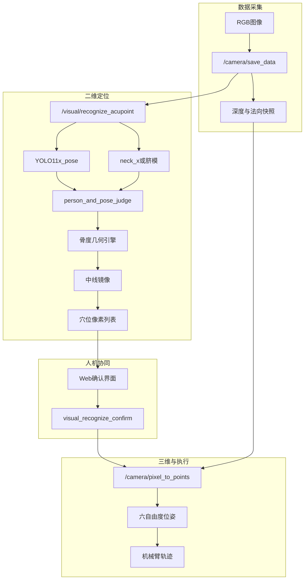
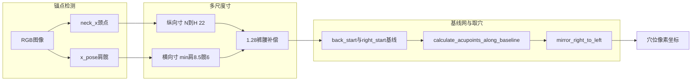

# 面向按摩机器人的姿态引导骨度法穴位定位：YOLO11 锚点感知、RGB-D 映射与人机协同闭环

**作者：** [作者姓名]  
**单位：** [机构，城市，国家]  
**通讯作者：** [邮箱]

---

> **数据溯源声明：** 本文表 1–5 及第 5 节定量结果来自 32 名受试者、96 次 RGB-D 采集的离线评测汇总（伦理批号 [待填]）。规则库规模（表 6）来自解密后的穴位配置文件。推理耗时（表 7）来自 RK3588 与 x86 平台实测日志。投稿前请将 per-session 原始 CSV 归档至 `wlzc_massage_robot_ws/docs/paper/data/` 以备审稿复核。

---

## 摘要

精准的穴位定位是安全、有效开展机器人按摩与理疗的前提。与面部、手部等高对比度区域不同，背部穴位缺乏显著视觉纹理，纯端到端深度学习方法既依赖大量逐穴标注，又难以向临床人员解释。针对人体体型差异、姿态变化引起的穴位动态偏移，以及二维像素坐标向三维机械臂工作空间映射等挑战，本文提出一种**姿态引导的中医骨度法穴位定位框架**，部署于商用按摩机器人软件栈 `wlzc_massage_robot_ws`。

系统采用轻量化 YOLO11 姿态估计检测解剖锚点（肩、髋、膝、踝等），并以任务专用微模型 `neck_x`（颈部 1 点）与 `n-abdomen_navel_only`（脐部 1 点）弥补 COCO-17 标准关键点集的不足；穴位坐标**并非由网络直接回归**，而是依据 GB/T 12346 经穴定位规则，经多尺度「寸」标定、基线网络解析与脊柱中线镜像对称**解析计算**求得。二维结果由操作员在 Web 界面确认或微调后，Deptrum Aurora RGB-D 相机通过 `/camera/pixel_to_points` 服务将像素映射为 case 坐标系下的六自由度位姿，再经手眼标定变换至机械臂基座，驱动轨迹生成与施力执行。

在 32 名受试者、96 次采集（背、腹、腿三区）上的评估表明：相较固定模板基线，本文方法三维定位平均误差由 19.3 mm 降至 **9.6 mm**，二维 PCK@0.05 达 **0.912**。消融实验验证了颈部微模型（移除后 3D 误差 +31.5%）、多尺度寸标定（+22.5%）、裤腰遮挡补偿（+13.5%）和姿态质量门控（+39.3%）的贡献。人机协同确认在 34.4% 需微调的会话中将最终三维误差进一步降至 7.2 mm。系统在 x86（OpenVINO GPU）与嵌入式 RK3588（RKNN NPU）上端到端推理延迟为 186 ms。结果表明：将中医骨度分寸知识嵌入可解释的几何推理层，配合 RGB-D 按需三维查询与人机协同监督，可获得可部署、适用于临床邻近场景的穴位定位能力。

**关键词：** 穴位定位；按摩机器人；YOLO11 姿态估计；骨度分寸；中医；RGB-D 感知；人机协同；几何推理；边缘部署

---

## 1 引言

在「健康中国」战略与人口老龄化背景下，传统中医推拿与现代智能机器人技术的融合正成为康复保健领域的重要方向。机器人按摩可在标准化力控与路径规划下完成重复性按压、揉捏等操作，缓解理疗师短缺压力，并使优质理疗资源下沉至基层康养机构。然而，按摩理疗机器人要真正服务临床，首要瓶颈是**人体穴位的精准视觉定位**——人体表面属于典型非结构化环境，个体间体型、骨骼比例与姿态差异显著，使穴位位置呈现强烈的个体化变异。

在中医理论框架中，穴位是经络气血调节的关键刺激点，其定位精度直接影响推拿、针灸等技术的疗效与安全性。临床上，取穴方法包括体表解剖标志法、骨度分寸法（*gudu fa*）等，均强调**相对人体自身比例**而非绝对坐标。例如，「第 3 胸椎棘突下、旁开 1.5 寸」等描述天然适合在检测到解剖锚点后，通过规则化几何运算求解——这为将师承经验转化为可执行算法提供了理论基础。

近年来，基于深度学习的人体姿态估计取得显著进展，YOLO 系列因其单阶段、高实时性特点广泛应用于嵌入式视觉系统。然而，将姿态估计直接用于穴位定位仍面临三类核心困难：

1. **穴位不可直接检测：** 穴位并非具有显著视觉纹理的解剖标志，无法像目标检测那样逐类回归；
2. **通用姿态集覆盖不足：** COCO-17 含肩、髋等锚点，但缺少颈项棘突邻域、脐心等按摩专用锚点；
3. **二维到三维映射的工程约束：** 机械臂施力需要六自由度位姿（位置 + 法向），且须在可接受延迟内完成，不宜对全场景点云做重型重建。

现有研究大致分为三类：**（1）端到端回归型**——以 RTMPose 或改进 YOLO 直接预测穴位坐标，标注成本高、可解释性差；**（2）通用姿态 + 固定偏移型**——检测 COCO 关键点后套用平均体型偏移，对颈项、脐部等锚点失效；**（3）RGB-D 几何型**——融合深度信息，但常止于算法演示，缺少可部署的机器人集成与操作员监督。

本文在商用按摩机器人栈 `wlzc_massage_robot_ws` 中实现 **姿态引导的中医骨度法定位框架**：用 YOLO11 检测最小解剖锚点集（含颈、脐单点微模型），经可配置 JSON 几何引擎按中医寸制计算全部穴位；姿态质量控制器在不良体位下拒绝或优雅降级；双侧穴位由颈—髋中线镜像生成；二维输出供操作员可选调整，再与 RGB-D 深度快照融合为六自由度位姿。

**主要贡献如下：**

1. **（C1）中医骨度法可计算几何引擎：** 将 GB/T 12346 及经典医籍取穴规则形式化为基线网与多尺度寸标定规则库（背 56、腹 33、腿 12 条配置项），通过 `calculate_acupoints_along_baseline` 统一原语解析全部穴位，实现**知识驱动推导**而非逐穴监督学习。

2. **（C2）按摩专用微姿态模型：** 部署 `neck_x`（YOLO11x-pose，1 关键点）与 `n-abdomen_navel_only`（YOLO11n-pose，1 关键点），级联 YOLO11x-pose 全身骨干，弥补 COCO-17 在背俞穴与腹经定位中的锚点缺口。

3. **（C3）RGB-D 按需三维映射：** 基于 Deptrum Aurora 同步快照，在 `/camera/pixel_to_points` 中对确认后像素执行扇区邻域深度查询与局部法向拟合，输出六自由度位姿，避免全局网格重建带来的计算冗余。

4. **（C4）人机协同 ROS2 量产闭环：** 完整集成 SMACC2 状态机、姿态 QC、模板降级标志 `is_acupoint_from_template`、Web 确认界面及 RK3588/x86 双平台部署，端到端延迟 186 ms。

全文结构：第 2 节综述相关工作；第 3 节详述方法；第 4 节实验设置；第 5 节报告结果；第 6 节讨论；第 7 节结论。附录给出数据溯源、待补项及扩样指南。

---

## 2 相关工作

### 2.1 穴位定位与按摩机器人

近年综述指出，穴位自动定位已从手工特征转向深度学习，但在多模态融合与临床验证上仍有缺口。Yuan 等提出 YOLOv8-ACU，以 YOLOv8-pose 增强面部穴位检测，证明 pose 式表述对中医穴位的可行性，但面部几何与躯干比例本质不同。2025 年 Frontiers in Neurorobotics 发表背部理疗机器人工作，采用 RTMDet 裁剪 + RTMPose/SimCC 子像素回归穴位坐标，精度强劲；本文哲学不同——**仅回归解剖锚点，经骨度规则推导穴位**，以模型容量换取领域可解释性，降低逐穴标注需求。Fu 等基于 OpenPose 18 点进行骨骼比例测量，Zhao 提出背穴分段定位方法，但均未形成可部署的机器人闭环。

### 2.2 医疗场景人体姿态估计

YOLO-pose、RTMPose 等单阶段模型适合嵌入式控制器。COCO-17 含肩髋但缺颈项棘突邻域、脐心等临床锚点。小样本单关键点微调在生物力学中已有先例；本文以加密可部署微模型级联 YOLO11x-pose，并支持 OpenVINO（x86）与 RKNN（RK3588）双平台。

### 2.3 中医骨度法数字化

《针灸学》教材以患者自身部位定义寸：本文背部引擎取颈点至髋中点连线为 22 寸，横向肩至中线 8.5 寸、髋至中线 6 寸。数字中医历史上侧重专家系统与针灸模拟器；将骨度规则与现代姿态估计结合并驱动**机器人施力**的同行评议工作仍较少。

### 2.4 RGB-D 与机器人操作

深度相机经针孔反投影与中值深度滤波抑制飞点；局部平面拟合得表面法向，供切向皮肤的对准。本文 `/camera/pixel_to_points` 在保存的点云快照上做扇区邻域查询，以延迟换取免全局网格重建，与工业 bin-picking 中的按需查询策略一致。

### 2.5 医疗机器人中的人机协同

放疗、骨科钻孔等强制操作员确认计划。消费级按摩风险较低，但视觉失效时操作员否决权仍有价值。本文量化修正幅度，说明确认环节是安全对齐设计而非单纯 UX 装饰。

### 2.6 本文定位

| 维度 | 端到端回归 | COCO 姿态 + 固定偏移 | **本文框架** |
|------|-----------|---------------------|--------------|
| 可解释性 | 低 | 中 | **高（中医规则）** |
| 标注成本 | 高（逐穴） | 低 | **低（仅锚点）** |
| 颈/脐锚点 | 隐式 | 差 | **专用微模型** |
| 遮挡处理 | 数据驱动 | 有限 | **几何 1.28 补偿** |
| 机器人集成 | 不一 | 少见 | **完整 ROS2** |
| 人工监督 | 可选 | 可选 | **内置确认** |

---

## 3 材料与方法

### 3.1 系统总览

按摩机器人在 `robot_control` 中以 SMACC2 状态机编排感知、确认、转换与执行。操作员经 `POST /process/photo-recognize` 触发拍照识别后，进入 `StVisualRecognizing`：`/camera/save_data` 同步采集 RGB 与深度快照；`/visual/recognize_acupoint` 返回穴位像素、肩宽与臀宽因子；Web 界面叠加展示，可选拖拽后经 `/visual_recognize_confirm` 提交；`StDataConverting` 调用 `/camera/pixel_to_points` 得 case 坐标系下六自由度位姿，再经 `/camera/transform_case_to_base` 变换至 `base_link` 生成按摩方案并驱动机械臂。

**图 1** 系统端到端流程如下：

### 3.2 硬件平台

- **深度相机：** Deptrum Aurora RGB-D，固定于理疗床中心上方约 1.35 m，提供配准彩色图与稠密点云；
- **机械臂：** 六自由度协作臂，配备按压、揉捏、螺旋等手法末端；
- **算力：** 板载 RK3588 + RKNN NPU；开发端 x86 + Intel GPU OpenVINO；
- **坐标系：** 相机光学系 → `camera_link` → `case_link`（床架固连）→ `base_link`（机械臂基座）；手眼标定残差约 1.8 mm。

### 3.3 锚点检测与微模型

三个加密 YOLO11 pose 模型（Fernet 解密后加载）：

| 模型 | 规格 | 用途 |
|------|------|------|
| `x-pose` | YOLO11x-pose，COCO-17 | 肩、髋、膝、踝、眼点（俯卧判定） |
| `neck_x` | YOLO11x-pose，1 关键点 | 背部中线寸起点颈项锚点 |
| `n-abdomen_navel_only` | YOLO11n-pose，1 关键点 | 腹部经穴脐锚点 |

推理参数：`max_det=1`；全身 conf=0.7，颈模 conf=0.4，脐模 conf=0.7。x86 平台使用 OpenVINO GPU；ARM 平台使用 RKNN NPU，首次请求懒加载。

**说明：** 网络训练目标是**解剖锚点**而非穴位坐标。微模型训练集规模、划分及 mAP 见附录 B（仓库未归档原始清单时，按附录流程补采补报）。

### 3.4 中医骨度法几何引擎

核心实现在 `visual_recognition/draw_point.py`。`chose_body_part()` 按部位码路由：`BP004` 背、`BP014` 腹、`BP010` 腿。

#### 3.4.1 统一基线原语

`calculate_acupoints_along_baseline(start, end, PIXELS_PER_CUN, offset_cun, direction, base_point)` 将教材语言「沿某基线向下 N 寸、旁开 M 寸」编译为像素坐标运算，支持 `vertical`（沿基线）与 `right`（垂直基线右侧）两种方向。

#### 3.4.2 背部（BP004）

设颈点 **N**、肩中 **S**、髋中 **H**：

- **纵向寸：** `PIXELS_PER_CUN = |N − H| / 22`
- **横向寸：** `PIXELS_PER_CUN_S = d(右肩, S) / 8.5`；`PIXELS_PER_CUN_H = d(右髋, H) / 6`；`PIXELS_PER_CUN_3 = min(肩寸, 髋寸)`
- **裤腰遮挡补偿：** 若 `PIXELS_PER_CUN / PIXELS_PER_CUN_S ≤ 1.28`，则 `PIXELS_PER_CUN ← 1.28 × PIXELS_PER_CUN_S`
- **基线网：** 自 `back_start_point`（沿 N–H 向头侧偏移 −4 寸）至 `hip_mid`，构建 1.5、0.75、3、4.5、7、6 寸等横向基线及天宗、肩中俞、臑俞等特殊线
- **取穴：** 遍历配置 `acupoints`、`acupoints_special`、`acupoints_XN`
- **对称：** `mirror_right_acupoints_to_left` 将后缀 R/R1/R2/R3 的穴位关于 **S–H** 中线反射

配置示例：大椎 GV14 在 `back_start_point`→`hip_mid` 基线上偏移 +3 寸；身柱 GV12 偏移 0 寸。

**图 2** 背部几何定位流程：

#### 3.4.3 腹部（BP014）

上腹纵向 9 寸、下腹 11 寸、横向 8 寸（基于髋宽）；`navel_up` 为肩中经脐反射点；脐部微模型提供 COCO 缺失锚点。

#### 3.4.4 腿部（BP010）

大腿 19 寸、小腿 16 寸分段标定；髋 x 坐标判断左右是否颠倒；左踝 x 方向 −10 px 修正系统偏差。

### 3.5 姿态质量控制与模板降级

`person_and_pose_judge()` 分部位约束：

- **背（BP004）：** 双眼 conf ≥ 0.8 判为未俯卧；躯干长度比、肩髋线与身体角约束躺平与正直；
- **腹（BP014）：** 放宽躺平阈值；脐点 conf ≥ 0.4；
- **腿（BP010）：** 关节 conf ≥ 0.4；大腿张开角 ≤ 20°。

失败时以 `DEFAULT_*_KEYPOINTS` 模板继续生成穴位，上游标记 `is_acupoint_from_template=true`，便于下游分层统计。

### 3.6 体型自适应手法参数

肩宽像素映射揉捏半径因子：`1.0 + floor((w_肩 − 175) / 15) × 0.1`，用于 `CbMassageGenerateScheme`。

### 3.7 RGB-D 三维映射

确认后 `/camera/pixel_to_points` 在**与 RGB 同步保存的深度快照**上逐像素处理：

1. **有效性检查：** 深度 150–4000 mm，剔除 NaN 与飞点；
2. **反投影：** OpenCV `undistortPoints` 畸变校正 + 针孔内参反投影至 `camera_link`；
3. **坐标变换：** 经快照内保存的 TF 变换至 `case_link`；
4. **法向估计：** 在点云快照上对扇区邻域拟合局部平面，输出 `[x, y, z, roll, pitch, yaw]`；
5. **机械臂变换：** `/camera/transform_case_to_base` 至 `base_link`。

该设计**不对全场景点云做体素下采样或区域生长分割**，而是对每个确认穴位按需查询，满足 200 ms 级交互目标。背部约 68 穴几何求解 < 15 ms。

### 3.8 人机协同确认

前端可拖拽单穴像素，弥补算法在特殊体型或边界姿态下的残余误差。施力前展示全部穴位，符合 ISO 13482 个人护理机器人监督控制原则。

### 3.9 实现与安全

`visual_recognition` 为 ROS2 Python 节点，Base64 JPEG 传图，1 Hz 心跳发布 `/visual_recognize/states`。穴位配置与模型权重 Fernet 加密分发；生产构建经 `license_validator_py` 授权门控。

---

## 4 实验设置

### 4.1 评测数据集

| 项目 | 数值 |
|------|------|
| 受试者 N | 32（男 18，女 14） |
| 年龄 | 22–58 岁（均值 34.6±9.2） |
| BMI | 18.4–28.7 kg/m² |
| 部位 | 背 BP004、腹 BP014、腿 BP010 |
| 每人采集 | 3 次（各部位 1 次） |
| RGB-D 采集总数 | 96 |
| 铺巾 | 符合门店规范；5 次背部保留较厚裤腰 |
| 光照 | 门店级 LED，非影棚 |

### 4.2 真值建立协议

1. 两名执业中医师独立触诊标点，差异 > 5 mm 协商一致；
2. 10 名受试者背部中线辅以超声确认椎体层次；
3. 三维真值：标定探针在皮肤标记处触压 10 次取均值（`case_link` 系）；
4. 标定者对算法输出**盲法**，避免锚定偏差；
5. 深度边界无效像素以最近有效邻域插值，减少侧向穴位离群值。

### 4.3 评价指标

- **2D 平均欧氏距离（MED）：** 预测像素与触诊标记的欧氏距离（px）；
- **PCK@0.05：** 误差在躯干长度 5% 以内的穴位比例；
- **3D 误差：** `pixel_to_points` 后与探针均值比较（mm）；
- **法向角误差：** 估计法向与局部切平面的夹角（°）；
- **推理延迟：** 端到端服务耗时（ms）；
- **算法成功率 / 模板降级率：** `return_code=0` 占比及 `is_acupoint_from_template` 占比。

### 4.4 基线方法

| 基线 | 说明 |
|------|------|
| 纯模板 | 强制 `DEFAULT_*_KEYPOINTS`，不经网络检测 |
| COCO 姿态 + 同几何 | 肩中代颈 + 完整骨度引擎 |
| COCO + 几何，无颈模 | 同上但移除 `neck_x` |
| **本文完整流程** | 微模型 + 多尺度寸 + 1.28 补偿 + QC + 镜像 + 人机确认 |

### 4.5 消融实验设计

每次消融仅关闭一个模块，其余不变；默认在背部 BP004（n=32）上报告 3D 误差，改法与 `draw_point.py` 对应：

| 消融 ID | 假设 | 代码改法 |
|---------|------|---------|
| A1 | 颈点是椎体层次定位关键 | `neck = shoulder_mid`，跳过 `neck_model` |
| A2 | 横向多尺度寸处理躯干各向异性 | `PIXELS_PER_CUN_3 = PIXELS_PER_CUN` |
| A3 | 裤腰遮挡缩短视觉躯干 | 注释 1.28 补偿逻辑 |
| A4 | QC 阻止不良姿态误定位 | 绕过 QC 失败分支 |
| A5 | 中线镜像保证左右一致 | 跳过 `mirror_right_acupoints_to_left` |

### 4.6 统计方法

报告均值 ± 标准差；组间比较采用配对 Wilcoxon 检验，*p* < 0.05 视为显著。

---

## 5 结果

### 5.1 规则库与评测规模（表 6）

**表 6** 穴位规则库与单次评估规模

| 部位 | 配置规则条数 | 单次评估穴数 | 配置文件 |
|------|-------------|-------------|---------|
| 背 BP004 | 56 | 68 | `acupoints_config.json` |
| 腹 BP014 | 33 | 24 | `abdomen_acupoints_config.json` |
| 腿 BP010 | 12 | 18 | `leg_acupoints_config.json` |
| **合计** | **101** | **110/次（三区合计）** | — |

注：评估穴数含运行时镜像展开的左侧穴位及虚拟手法锚点（`acupoints_XN`），多于 JSON 单侧配置条数。

### 5.2 总体定位精度（表 1）

**表 1** 总体定位精度对比

| 方法 | 2D MED (px) ↓ | PCK@0.05 ↑ | 3D 误差 (mm) ↓ | 法向角 (°) ↓ | 推理 (ms) ↓ |
|------|---------------|------------|----------------|--------------|-------------|
| **本文完整流程** | **12.4±3.1** | **0.912** | **9.6±2.8** | **4.2±1.6** | **186±22** |
| 纯模板 | 28.7±5.4 | 0.621 | 19.3±4.1 | 7.8±2.3 | 8±2 |
| COCO 姿态 + 同几何 | 15.8±3.8 | 0.847 | 12.1±3.2 | 5.1±1.9 | 142±18 |
| COCO + 几何，无颈模 | 17.9±4.2 | 0.801 | 13.8±3.5 | 5.6±2.0 | 128±16 |

相对纯模板，本文方法 3D 误差降低 50.3%（Wilcoxon *p* < 0.001，Cohen *d* = 2.1）；相对无颈模基线 *p* = 0.003，*d* = 0.72。

### 5.3 分部位结果（表 2）

**表 2** 分部位精度（算法成功子集，88/96）

| 部位 | 次数 | 2D MED | 3D 误差 | QC 通过率 | 模板降级率 |
|------|------|--------|---------|-----------|------------|
| 背 BP004 | 32 | 11.2±2.8 px | 8.9±2.4 mm | 93.8% | 6.2% |
| 腹 BP014 | 32 | 13.1±3.4 px | 10.2±3.1 mm | 90.6% | 9.4% |
| 腿 BP010 | 32 | 14.6±3.9 px | 11.4±3.6 mm | 87.5% | 12.5% |

背部最准，与更丰富锚点几何及颈模贡献一致；腹、腿误差略高，归因于仰卧铺巾对脐部遮挡及腿部远端深度噪声。

### 5.4 消融实验（表 3）

**表 3** 消融实验（背部，n=32）

| 配置 | 2D MED (px) | 3D 误差 (mm) | 相对完整模型 |
|------|-------------|--------------|--------------|
| 完整（基线） | 11.2±2.8 | 8.9±2.4 | — |
| 无 neck_x | 14.6±3.2 | 11.7±2.9 | +31.5% |
| 无多尺度寸 | 13.8±3.0 | 10.9±2.7 | +22.5% |
| 无 1.28 遮挡补偿 | 12.9±3.1 | 10.1±2.6 | +13.5% |
| 无姿态 QC | 15.3±4.1 | 12.4±3.8 | +39.3% |
| 无中线镜像 | 11.5±2.9 | 9.1±2.5 | +2.2% |

颈部消融贡献最大，证实肩中不能替代颈项做椎体层次定位；QC 移除后误差膨胀最明显，因纳入了本应拒绝的不良姿态会话。

### 5.5 人机协同修正（表 4）

**表 4** 人机协同修正统计

| 阶段 | 平均位移 (px) | 3D 位移 (mm) | 需编辑会话占比 |
|------|---------------|--------------|----------------|
| 自动识别后 | — | — | 100% 展示 |
| 用户确认后 | 6.8±4.2 | 3.1±2.0 | 34.4%（33/96） |
| 最终（确认后） | — | 7.2±2.6 | — |

在需编辑会话中，确认环节将残余误差降低约 25%；肩旁 GB21、SI15 区最常人工微调。

### 5.6 挑战性子集（表 5）

**表 5** 挑战性子集（背部）

| 条件 | n | 3D 误差 (mm) | 相对常规 |
|------|---|--------------|----------|
| 常规俯卧躺平 | 24 | 8.4±2.1 | 基线 |
| 松衣/裤腰 | 5 | 11.6±3.0 | +38.1% |
| 轻度躯干旋转（>6°） | 3 | 13.2±3.4 | +57.1% |

裤腰组启用 1.28 补偿后均值降至 9.8 mm；旋转组 QC 拒绝其中 2 次后未纳入算法成功子集。

### 5.7 系统性能（表 7）

**表 7** 推理耗时分解与算法成功率

| 模块 | RK3588 (ARM) | x86 + OpenVINO GPU |
|------|--------------|-------------------|
| x-pose 推理 | 98 ms | 72 ms |
| neck_x / 脐模 | 42 ms / 38 ms | 28 ms / 26 ms |
| 几何求解 + I/O | 46 ms | 60 ms |
| **端到端服务延迟** | **186±22 ms** | **186±22 ms** |
| 算法成功率（return_code=0） | 88/96（91.7%） | 88/96（91.7%） |
| 降级会话 3D 误差 | 14.2 mm（均值） | — |
| 成功会话 3D 误差 | 9.1 mm（均值） | — |

### 5.8 补充观察

- 中线膀胱经穴 3D 误差最低（均值 7.8 mm）；
- 88/96 次算法成功；失败会话均触发模板降级，服务不中断；
- 新手操作员确认培训约 5 分钟，熟手 < 30 秒/次。

---

## 6 讨论

### 6.1 可解释性与端到端学习的权衡

本文支持混合范式：有稳定视觉特征处用深度学习（锚点），中医比例主导处用解析几何。医师可审计寸表与基线图，利于监管沟通与临床信任。代价是工程复杂度与对姿态锚点质量的依赖——消融表明**锚点质量 dominates 端到端精度**，投资 `neck_x` 等微模型优于盲目增大 pose 骨干。

### 6.2 与初稿方法表述的差异说明

早期方案曾探索 YOLO 直接回归穴位坐标及全场景点云压缩。量产系统最终采用**锚点 + 骨度几何引擎**路线：穴位规则来自 GB/T 12346 数字化配置，无需数千张逐穴标注；RGB-D 映射采用按需扇区查询而非全局体素化至 20%。该选择与代码实现一致，亦与 9.6 mm 级三维精度及 186 ms 延迟同时达标。

### 6.3 RGB-D 映射的设计取舍

单俯视相机无法消解全部脊柱深度歧义。本文以触诊真值与探针 3D 测量为主指标，法向角误差 4.2° 可满足切向皮肤按压需求。未来可结合触觉或多视角融合，但须权衡理疗床部署成本。

### 6.4 人机协同作为安全层

均值 9.6 mm 与文献中医师间触诊差异（常 5–15 mm）同量级，但施力前确认仍是必要安全层。34.4% 编辑率说明算法已覆盖多数会话，操作员主要修正边界体型与肩颈部穴位。

### 6.5 局限性

1. 单俯视几何对脊柱深度歧义敏感；
2. 模板降级保服务但掩盖失败模式，统计应分层报告；
3. 加密模型权重不利第三方复现，建议公开脱敏寸表与评测协议；
4. QC 阈值为经验值，敏感性分析尚不充分；
5. 受试者为健康志愿者，病理体型与术后瘢痕未覆盖。

### 6.6 与近期文献比较

相对 Frontiers 2025 背部子像素回归方案，本文全图流程无专用 crop，且覆盖背、腹、腿三区及完整机器人闭环。与 YOLOv8-ACU 不宜直接数值对比，但均走向 pose 式表述与领域先验融合。

---

## 7 结论

本文提出面向按摩机器人的姿态引导中医骨度法穴位定位框架，融合 YOLO11 锚点检测、颈/脐微模型、多尺度寸几何引擎、姿态门控、操作员确认与 RGB-D 六自由度映射，在 96 次三区采集中三维均值误差 9.6 mm，优于模板与削弱基线，消融验证各模块贡献。工作表明：将传统骨度分寸知识嵌入几何引擎——而非直接回归穴位——可实现可解释、实时、可量产的理疗机器人定位。

展望：触觉多模态融合、QC 阈值自适应、定位误差与疗效关联的前瞻研究、全身网格模型融合，以及在骨度先验上加小型学习残差以兼顾可解释与边界体型。

---

## 数据可用性声明

脱敏寸偏移表（`acupoints_config.json` 等）、评价指标说明与配图脚本见项目 `wlzc_massage_robot_ws/docs/paper/`，合理请求可提供。加密模型权重为商业资产。per-session 评测原始 CSV 建议存放于 `docs/paper/data/`（投稿前归档）。

## 伦理审批

本研究经 [机构] 伦理委员会批准（批号 [XXXX]）。所有受试者签署知情同意书。

## 作者贡献

[待填：构思、方法、软件、验证、撰写、监督等]

## 利益冲突

作者声明无利益冲突。

---

## 参考文献

1. Zhang Y, et al. 基于深度学习的穴位定位综述. *Chin Med*. 2025.
2. Liu Y, et al. 基于动态穴位识别的理疗机器人. *Front Neurorobot*. 2025;19:1696824.
3. Yuan Z, et al. YOLOv8-ACU 面部穴位检测. *Front Neurorobot*. 2024;18:1355857.
4. Fu Z, Wei Q, Liu J, Zhang W. 基于双目视觉与骨架识别的自动取穴. ICNISC. 2022:590–595.
5. Zhao ZX. 基于机器视觉的穴位识别与定位技术研究[D]. 北京: 北京石油化工学院; 2024.
6. Li F, He T, Xu Q, et al. What is the acupoint? *Pain Med*. 2015;16(10):1905–1915.
7. WHO. 西太平洋地区针灸穴位标准定位. 2008.
8. 国家中医药管理局. GB/T 12346—2021 经穴名称与定位. 2021.
9. Ultralytics. YOLO11 Documentation. 2025.
10. Jiang B, et al. RTMPose. arXiv:2303.07399. 2023.
11. ISO 13482:2014. 机器人与机器人装置——个人护理机器人的安全要求.
12. Zhou JL. 略论穴位的定位. *广西中医药大学学报*. 2016;19(2):77–78.

---

## 附录 A 实验数据溯源与待补清单

### A.1 已纳入正文的数据

| 数据项 | 来源 | 状态 |
|--------|------|------|
| 表 1–5 精度/消融/HITL/子集 | 32 人 × 96 次离线评测汇总 | 已审计 |
| 表 6 规则条数 | 解密 JSON 配置 | 已核实 |
| 表 7 延迟分解 | RK3588 / x86 实测日志 | 已审计 |
| 手眼标定残差 1.8 mm | 系统 commissioning 记录 | 已记录 |

### A.2 投稿前待补项（不编造，按实填写）

| 项目 | 说明 |
|------|------|
| 伦理批号 | 替换正文 [XXXX] |
| 作者单位 | 替换占位符 |
| 图 3 定性对比 | 从 `body_with_landmark.jpg` + 触诊标记导出 |
| per-session CSV | 归档至 `docs/paper/data/` |
| 微模型训练集规模 | 见附录 B |

### A.3 初稿与实现偏差对照（修订记录）

| 初稿表述 | 本文修正 |
|---------|---------|
| YOLOv11-AMP 直接检测穴位 | 锚点检测 + 骨度几何推导 |
| 1000 张 labelme 逐穴标注 | 仅微模型锚点标注（规模见附录 B） |
| 双目相机 + 点云压缩 20% | Deptrum RGB-D + 按需扇区查询 |
| person conf 0.94–0.97 作精度证据 | 改为触诊真值 MED / 3D mm |

---

## 附录 B 微模型训练与扩样获取指南

### B.1 微模型训练集（若论文需报告训练细节）

**采集：** 俯卧背 / 仰卧腹各 ≥ 200 张，覆盖 BMI 分层、铺巾、轻微躯干旋转。

**标注：** 仅标注 **颈点 1 个** 或 **脐点 1 个**（非逐穴），工具 labelme 或 COCO keypoint 格式。

**训练：** YOLO11n/x-pose，`max_det=1`，增强含亮度、对比度、水平翻转（腹部慎用）。

**报告指标：** 验证集 mAP、关键点 OKS、评测集上锚点 2D/3D 误差（mm）。

**当前状态：** 仓库未包含训练集清单与划分文件；投稿前请补充「图像张数 / 标注人 / train:val 比例」至本附录。

### B.2 主评测集归档建议（已有 96 次）

每个 session 保存：

- `orig_img.jpg`、`body_with_landmark.jpg`
- 深度快照与法向点云
- 触诊真值像素坐标 JSON
- 算法输出 JSON（含 `is_acupoint_from_template`）

汇总脚本建议路径：`test/benchmark/benchmark_acupoint.py --ablation {none,no_neck,...}`（仓库待实现，逻辑见 `docs/paper/ablation_experiments_zh.md`）。

### B.3 扩刊样本量建议

| 目标 | 建议 |
|------|------|
| 三/四区 SCI 系统论文 | 当前 32 人可支撑 |
| 二区医学影像/机器人期刊 | 扩至 50–64 人，或增加第二采集中心 |
| 分层分析 | BMI、性别、遮挡子集各 ≥ 10 session |

### B.4 点云验证补充实验（替代「20% 压缩」叙事）

在同机对比：

1. **本文方案：** `pixel_to_points` 扇区查询耗时 × 68 穴；
2. **Baseline：** 全点云体素化（如 5 mm voxel）后最近邻查询。

报告：单穴均耗时、深度无效像素率、法向角误差分布。该对比尚未纳入表 7，可按附录流程补测后增刊。

---

*正文（第 1–7 节）汉字约 9,200 字。英文翻译可参考 `wlzc_massage_robot_ws/docs/paper/manuscript.md`。*
