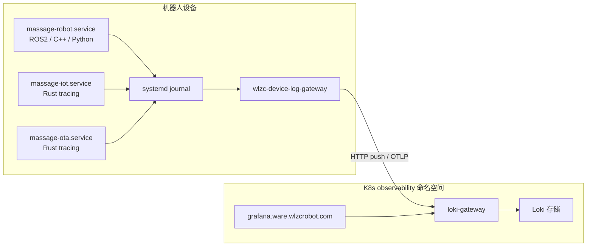

# 02 — 架构与数据流

## 总体架构

按摩机器人日志体系采用 **设备采集 + 云端存储 + Grafana 查询** 三层结构，核心组件均为开源软件。



图源文件：[assets/architecture.mermaid](assets/architecture.mermaid)

## 各层说明

### 设备侧：应用 → journal

三台核心服务均将标准输出/错误输出交给 systemd journal：

| 服务 | systemd 单元 | 技术栈 | Loki `service_name` |
|------|-------------|--------|---------------------|
| 按摩主程序（本仓库） | `massage-robot.service` | ROS2 Humble、C++、Python FastAPI | `robot` |
| IoT 网关 | `massage-iot.service` | Rust（tracing） | `iot` |
| OTA 升级 | `massage-ota.service` | Rust（tracing） | `ota` |

本仓库 [`package/massage-robot.service`](../../package/massage-robot.service) 关键配置：

```ini
StandardOutput=journal
StandardError=journal
SyslogIdentifier=massage-robot
```

启动脚本 [`package/start-robot.sh`](../../package/start-robot.sh) 另将启动过程写入 `/var/log/massage_robot/robot_launch.log`，该文件**不经过 journal**，默认不会进入 Loki。

### 设备侧：wlzc-device-log-gateway

`wlzc-device-log-gateway` 是设备上的日志采集代理（scope 标签为 `wlzc-device-log-gateway`），职责包括：

- 订阅 systemd journal（日志中带 `journal_cursor` 标签可佐证）
- 解析日志级别，打上 `severity`、`severity_text`、`severity_number` 等 OTel 风格标签
- 附加设备元数据：`device_id`、`product`、`environment`、`service_version`
- 按来源单元映射 `service_name`（robot / iot / ota）
- 推送到云端 Loki Gateway

网关实现与安装包不在本仓库，由设备镜像/运维统一部署。

### 云端：Loki + Grafana

| 组件 | 线上配置（API 探测） |
|------|---------------------|
| Grafana | v13.1.0 OSS，<http://grafana.ware.wlzcrobot.com> |
| 数据源 | `Robot Loki`，uid `robot-loki`，proxy 模式 |
| Loki 地址 | `http://loki-gateway.observability.svc.cluster.local`（K8s `observability` 命名空间） |
| Dashboard | uid `robot-device-logs`，文件夹 `Robot Observability`，classic file provisioning |

Grafana 通过集群内网访问 Loki，对外仅暴露 Web UI。

## Loki 标签体系

### 流标签（索引标签，用于 `{...}` 选择器）

| 标签 | 示例值 | 说明 |
|------|--------|------|
| `product` | `massage_robot` | 产品线 |
| `service_name` | `robot`, `iot`, `ota` | 逻辑服务 |
| `environment` | `test` | 部署环境 |
| `severity` | `INFO`, `ERROR` | 日志级别 |

### 结构化标签（解析/附加，常用于行过滤 `| label="value"`）

| 标签 | 说明 |
|------|------|
| `device_id` | 设备唯一标识 |
| `service_version` | 整机版本号 |
| `systemd_unit` | 来源单元，如 `massage-robot.service` |
| `process_pid` | 进程 PID |
| `journal_cursor` | journal 游标，用于去重/续传 |
| `scope_name` | 采集器名称 `wlzc-device-log-gateway` |
| `detected_level` | 从正文检测的级别 |

**设计原则**：高基数标签（如 `device_id`）不作为流标签索引，而通过行过滤器查询，避免 Loki 索引膨胀。Dashboard 中 `device_id` 变量即采用 `| device_id=~"$device_id"` 方式。

## 日志格式示例

### robot 服务（ROS2 / C++）

```
[robot_control_node-11] [INFO 2026-08-10 17:57:08.598] [robot_control_node]: [SignalDetector] Heartbeat
```

### iot 服务（Rust tracing）

```
INFO massage_iot::cloud::heartbeat: 已上报心跳 device_id=... authorized=true
```

（线上可能含 ANSI 转义序列。）

### ota 服务（Rust tracing）

```
INFO massage_ota::transport::auth: IoT auth token 已刷新
```

## 本仓库日志：本地 vs 云端

| 日志来源 | 本地路径 / 命令 | 是否进入 Loki | 说明 |
|----------|----------------|---------------|------|
| ROS2 节点 stdout/stderr | `journalctl -u massage-robot` | 是（`service_name=robot`） | 主要排障来源 |
| robot_api 文件日志 | `/var/log/massage_robot/robot_api.log` | 否（默认） | [`logger.py`](../../src/robot_api/robot_api/app/utils/logger.py) 按天滚动，保留 7 天 |
| 启动脚本日志 | `/var/log/massage_robot/robot_launch.log` | 否（默认） | [`start-robot.sh`](../../package/start-robot.sh) |
| ROS2 内部日志 | `~/.ros/log/` | 否 | 由 [`clean-logs.sh`](../../package/clean-logs.sh) 定期清理 |
| HTTP 请求 trace | 响应头 `X-Request-ID` / `X-Trace-ID` | 仅当业务日志打印到 journal 时可搜 | [`logging.py`](../../src/robot_api/robot_api/app/middleware/logging.py) |

### 本地查看命令（设备现场）

```bash
# 实时跟踪主服务 journal
sudo journalctl -u massage-robot -f

# 查看 robot_api 文件日志
tail -f /var/log/massage_robot/robot_api.log

# 查看 IoT 服务（若已安装）
sudo journalctl -u massage-iot -f
```

详见 [package/readme.md](../../package/readme.md) 中的服务管理与日志清理章节。

### 何时用本地、何时用 Grafana

| 场景 | 推荐方式 |
|------|----------|
| 设备旁现场调试、刚改完代码 | 本地 `journalctl -f` |
| 查历史、多台设备对比、远程排障 | Grafana Explore / Dashboard |
| 查 robot_api 专用格式、uvicorn 访问细节 | 本地 `robot_api.log` |
| 查 IoT 心跳、OTA 鉴权 | Grafana `service_name=iot` 或 `ota` |

## 与业务遥测的区别

本仓库还有 **云端状态上报**（`cloud_status_reporter`、AI 检测仪心跳等），走的是 HTTPS/MQTT 业务 API，**不是** Loki 日志管道。两者互补：

- **Loki**：原始运行日志、错误栈、模块级 INFO
- **业务遥测**：结构化状态、会话统计、授权结果

## 下一步

- 查询语法与排障：[03-logql-and-labels.md](03-logql-and-labels.md)
- Dashboard 导入与变量：[04-dashboard-guide.md](04-dashboard-guide.md)
- 告警与可观测性扩展：[05-extension-roadmap.md](05-extension-roadmap.md)
